# PLAN — Kế Hoạch Triển Khai Toàn Diện Dự Án Luyện Thi Tiếng Anh & Chấm Điểm AI

**Tài liệu:** Project Implementation Plan (PLAN)  
**Phiên bản:** 2.1 (Detailed Task Breakdown)  
**Vai trò phụ trách:** Project Manager & Senior Software Engineer  
**Quy trình chuẩn hóa:** **Phase 1: Planning → Phase 2: Design (Google Stitch) → Phase 3: Code (Convert Design sang React Components + NestJS Backend)**

---

## 1. TỔNG QUAN CHIẾN LƯỢC VÀ LỘ TRÌNH (STRATEGY & ROADMAP)

Dự án được triển khai theo quy trình 3 giai đoạn nghiêm ngặt:

```mermaid
flowchart LR
    subgraph P1 ["Phase 1: PLANNING"]
        D1["PRD.md & Business Rules"]
        D2["TECH_ARCHITECTURE.md"]
        D3["PLAN.md & Task Breakdown"]
    end

    subgraph P2 ["Phase 2: DESIGN (Google Stitch)"]
        S0["Design System Setup"]
        S1["Batch 1: Auth & Catalog (6 screens)"]
        S2["Batch 2: Exam & Practice Rooms (6 screens)"]
        S3["Batch 3: Skills, Results & Profile (6 screens)"]
        S4["Batch 4: Builder & Admin Core (9 screens)"]
        S5["Batch 5: Grading & Class Mgmt (10 screens)"]
        S_Review["Audit 37/37 Stitch Screens"]
    end

    subgraph P3 ["Phase 3: CODE (React + NestJS)"]
        C1["Tokens & React UI Library"]
        C2["Backend Core & Exam Engine"]
        C3["AI Modules (Azure + Gemini)"]
        C4["Teacher Portal & Class Mgmt"]
        C5["Integration & E2E Testing"]
    end

    P1 --> P2 --> P3
```

---

## 2. PHÂN RÃ TASK CHI TIẾT THEO TỪNG GIAI ĐOẠN (DETAILED TASK BREAKDOWN)

### 📌 PHASE 1: PLANNING & FOUNDATION (ĐÃ HOÀN TẤT)

| Task ID | Tên Nhiệm Vụ | Mô Tả Chi Tiết & Đầu Ra (Deliverables) | Trạng Thái |
|---|---|---|:---:|
| `TSK-P1-01` | Phân tích Yêu cầu Nghiệp vụ (BA Analysis) | Rà soát toàn bộ tài liệu nghiệp vụ mẫu, phân loại yêu cầu in-scope/out-scope, ma trận quyền RBAC, chốt các câu hỏi logic nghiệp vụ còn mở. | [x] Hoàn tất |
| `TSK-P1-02` | Biên soạn Tài liệu Yêu cầu Sản phẩm (`PRD.md`) | Xuất bản `PRD.md` v2.0 đầy đủ 37 màn hình, quy tắc tính lượt làm bài, quy tắc ẩn/hiện đáp án (`keep_correctness`), quy tắc chấm AI tham khảo. | [x] Hoàn tất |
| `TSK-P1-03` | Thiết kế Kiến trúc Kỹ thuật (`TECH_ARCHITECTURE.md`) | Xuất bản `TECH_ARCHITECTURE.md` chi tiết kiến trúc NestJS + React Vite, PostgreSQL Prisma schema DDL, S3 Storage, Redis BullMQ, Audio Pipeline (Azure Speech + Gemini 2.5), Interceptor chống lộ đáp án. | [x] Hoàn tất |
| `TSK-P1-04` | Lập Kế hoạch Triển khai (`PLAN.md`) | Xuất bản `PLAN.md` với lộ trình 3 Phase chuẩn hóa, bảng phân rã chi tiết 37 màn hình Google Stitch thành 5 Batches và kế hoạch 6 Sprints. | [x] Hoàn tất |
| `TSK-P1-05` | Khởi tạo Repository GitHub (`webhoctienganh`) | Tạo GitHub repository `namvnp3008/webhoctienganh`, cấu hình remote origin và đẩy toàn bộ tài liệu, kiến trúc, kế hoạch dự án lên GitHub. | [x] Hoàn tất |
| `TSK-P1-06` | Khởi động Chu trình /startcycle & Đặc tả Kỹ thuật | Xuất bản `Technical_Specification.md` v1.0, tích hợp mục tiêu triển khai Database trên Supabase và Backend trên Render qua MCP. | [x] Hoàn tất |

---

### 🎨 PHASE 2: DESIGN TRỌN VẸN 37 MÀN HÌNH TRÊN GOOGLE STITCH

*Quy tắc: Thiết kế hoàn chỉnh toàn bộ 37 màn hình trên Google Stitch, lưu trữ Stitch Screen ID (IDF), hình ảnh xem trước và đặc tả các thành phần React UI Components bóc tách tương ứng.*

**Thông Tin Dự Án Trên GitHub & Google Stitch:**
- **GitHub Repository:** `https://github.com/namvnp3008/webhoctienganh` (Owner: `namvnp3008`, Default Branch: `main`)
- **Stitch Project Name:** `projects/12086767744907733135` (Title: `Lumina English - AI Exam Prep Platform`)
- **Stitch Project ID:** `12086767744907733135`
- **Design System Asset:** `assets/5502260407726081896` (`Lumina English Design System` - Primary: `#4F46E5`, Neutral: `#0F172A`, Roundness: `ROUND_EIGHT`, Dark Mode)
- **Hiện Trạng Thiết Kế (Nghiệm Thu Hoàn Tất 27/09/2026):** **37/37 màn hình cốt lõi + 4 Modals phụ trợ (100% Hoàn tất)** trên Google Stitch dự án `12086767744907733135`. Báo cáo nghiệm thu chi tiết tại [docs/PHASE2_STITCH_COMPLETION_REPORT_v3.0.md](file:///d:/demomcp/docs/PHASE2_STITCH_COMPLETION_REPORT_v3.0.md).

---

#### 2.0 Bước Nền Tảng: Thiết Lập Design System Trên Google Stitch
| Task ID | Nhiệm Vụ | Stitch Screen ID (IDF) | Thành Phần Tokens / Components Bóc Tách | Trạng Thái |
|---|---|---|---|:---:|
| `TSK-P2-00` | Setup Design System `Lumina English` | Asset: `5502260407726081896` | Color Palette (`#4F46E5`, `#10B981`, `#F59E0B`, `#0F172A`), Typography (`Plus Jakarta Sans`, `Inter`), Spacing 4px grid, Shadows & Glows. | [x] Hoàn tất |

---

#### 2.1 Batch 1: Xác Thực, Trang Chủ & Khám Phá Đề Thi (6 Màn Hình)
| Task ID | Screen ID | Tên Màn Hình | Stitch Screen ID (IDF) & Preview | Thành Phần React UI Components Bóc Tách (Atoms / Molecules / Organisms) | Trạng Thái |
|---|---|---|---|---|:---:|
| `TSK-P2-01` | `STU-01` | **Landing Page** | `d64069bfef5742188a3cc69fae23da87` [Xem ảnh Stitch](https://lh3.googleusercontent.com/aida/AEtjO1UrRHdLjzqU_UYWNGnMkzsLgZzCOpqMPGXGdryTi_IoGgUfPnvIWSMHqkaVBp2qUA_lVfxqacdVYu8K2beahQSN7oRgSTds3stofwBYiGXlctmLMYol6GJTKSvL_sdIxXMvnhdJG-inCfUhegQgA5F-NWpifTmvgqnMKVP9HDe5s_G6pnwEilnCrJCy1jHoL7_Vn0fbTbSA6iZpc6jdNZkELzNrByyMSKnRBZO2xoXoMbdo3SWmf-R3QDk1) | • `TopNavBar`: Sticky header, BrandLogo, NavLinks, SearchBar, AuthButtons • `HeroSection`: HighImpactBadge, Headline, StatsCounterBar, LiveAICoachPreviewCard • `FeaturedTestGrid`: CategoryFilterTabs, TestCardItem, DifficultyBadge • `FeatureHighlightCard`: ExamRoomCard, PronunciationCard, SpeakingCard, WritingCard • `TestimonialSection`, `LandingFooter` | [x] Hoàn tất |
| `TSK-P2-02` | `STU-02` | **Đăng ký & Đăng nhập** | `c42d7bde4fe54952b91c230f159f8ce0` [Xem ảnh Stitch](https://lh3.googleusercontent.com/aida/AEtjO1VDUIh_bLVMt76501ZePY_J1IaBIE5vKucpMiGFYW2wAePonqDIauEv4GtMXklbYiBlmOVT-FI35_iHOT0LnW8dO6uqOJjd6wLSqmfYx_5jnz14aHtSdv_NES2OeU-5ix20PfeaEt8NQ75eTn6wUpBdth2kr9Ar6MzGMuCobkZeYTaUzDu5VFkBlzIpg61vuIkEh0uX8_0lScF-b_K240wOiSWS00PkAlkPPOS_kQJ20M23bF2MlvosSW3q) | • `AuthTabSwitch`: Toggle Đăng nhập / Đăng ký • `GoogleOAuthButton`: Single-click auth button • `FormInput`: EmailInput, PasswordInput (kèm eye icon toggle), NameInput • `Checkbox`: RememberMe checkbox, TargetScoreSelect • `Button`: Primary Indigo CTA button • `AuthHeroBanner`: SocialProofCard, AI Band Badge | [x] Hoàn tất |
| `TSK-P2-03` | `STU-03` | **Quên & Đặt lại mật khẩu** | `8145aef8c8de4d39aee3bf2750d91ab2` [Xem ảnh Stitch](https://lh3.googleusercontent.com/aida/AEtjO1U0gJ6f6k62v_rG1vQ2Ewh7D6kglsKq1q5-T3a_6d_eR2Bv2y3C32QeJg0n5P_r_4W1s5T9-8W6V8Yg) | • `ForgotStepWizard`: Multi-step form container • `OTPCodeInput`: 6-digit verification code input • `PasswordStrengthMeter`: Visual indicator • `CountdownResendButton`: Đếm ngược gửi lại email | [x] Hoàn tất |
| `TSK-P2-04` | `STU-04` | **Danh mục Đề thi (Catalog)** | `e68497af849243f58d1894b0e0bf646f` [Xem ảnh Stitch](https://lh3.googleusercontent.com/aida/AEtjO1WIwYO13uJjZCE9mbTpNhVVUwN9Vz8ISFV92pG8L4ovnSjjK1U34BxMg6MwGFy74sHEZH0fe1bUJJN18FWQ4u61-yD0aD6zKn3AiQ5jIFNGLCxHq3yujBMIasrB2JrAlIBGcKJIlS43iEs0S7M34aGoVCAoldD1s11xk7m4fmr1OSK85hpANItuxvsgxs1MV8986qv3q6aZbKb2-3lQ-YWMboldpwlBb2bQGLbbIoDbMeOIO5RpEA-D7WSA) | • `FilterSidebar`: ExamTypeFilter, SkillCheckboxGroup, DifficultyFilter, YearCollectionFilter • `CatalogToolbar`: ActiveFilterChips, ResultCounter, SortDropdown, ViewModeToggle • `TestCardGrid`: TestCard (Thumbnail, Title, Tags, Meta, PersonalStatusBadge, ActionButton) • `PaginationControls`: PageNumbers, PrevNextButtons | [x] Hoàn tất |
| `TSK-P2-05` | `STU-05` | **Chi tiết Đề thi** | `205001f5139942278c1110544e7e40b2` [Xem ảnh Stitch](https://lh3.googleusercontent.com/aida/AEtjO1X7kRk01_k2G3a1_rM2Lg3P5eQ_9Jk1_L1s_0) | • `TestDetailBanner`: Title, Description, SkillBadges, CoverImage • `SectionStructureAccordion`: Danh sách sections, thời gian, số câu • `PersonalAttemptHistoryTable`: Lịch sử các lần làm, điểm số, lượt còn lại • `StartExamModal`: Chọn chế độ Full Test hoặc Luyện từng phần | [x] Hoàn tất |
| `TSK-P2-06` | `ADM-01` | **Đăng nhập Quản trị & Giáo viên** | `f312e01fca91475c87fc1c820dfa3100` [Xem ảnh Stitch](https://lh3.googleusercontent.com/aida/AEtjO1UP2k0_L9eQ3g_5P_L7gK01_M5k1) | • `AdminLoginForm`: Form đăng nhập bảo mật Slate-900 chuyên nghiệp • `AdminBrandBadge`: Nhãn bảo mật hệ thống quản trị nội bộ | [x] Hoàn tất |

---

#### 2.2 Batch 2: Phòng Thi Trực Tuyến & Phòng Luyện Tập Cốt Lõi (6 Màn Hình)
| Task ID | Screen ID | Tên Màn Hình | Stitch Screen ID (IDF) & Preview | Thành Phần React UI Components Bóc Tách (Atoms / Molecules / Organisms) | Trạng Thái |
|---|---|---|---|---|:---:|
| `TSK-P2-07` | `STU-06` | **Phòng thi Trực tuyến (Exam Room)** | `e1c3143eda44413ab82ade3ac33e4052` [Xem ảnh Stitch](https://lh3.googleusercontent.com/aida/AEtjO1VkMzqIpk8RldJ29UJ-OgUNPL1ejhZIY2CvhS53EYALbttfaXZYEmCkSkM4_UzPl0bEFkdB9hjKTBSdbHG8HWDOXDz_vNH82nKZxYSS_5enx5Lz3Kg-lUJ1tPq0Z_iTubEEVzWgC5NY0QSU_PsPCqAH4JulV3lVpAhsFuHegb3jPL83t3CrOtCcxozAaB4mNo95RsJDBmJ54v_wpPWpz00owkcp8wMqVXj26x9YlbiyK9M0pBJvoYKStu8) | • `ExamStickyHeader`: ExamTitleBadge, SectionNavTabs, CountdownTimer (mono), AutosaveBadge, FontSizeControl, SubmitButton • `SplitViewLayout`: Resizable 2-column container • `PassageViewer`: ReadingParagraphItem, TextHighlighterPopup, NoteTooltip • `QuestionSheet`: MatchingQuestionItem, TrueFalseRadioGroup, FillBlankInput • `StickyQuestionPalette`: QuestionGridPills (1-40), StatusSummary, PrevNextButtons | [x] Hoàn tất |
| `TSK-P2-08` | `STU-07` | **Phòng thi Writing** | `75d62123609b435eaf49b2185a770fab` [Xem ảnh Stitch](https://lh3.googleusercontent.com/aida/AEtjO1Uk6P_9G2l1_M0eK_7J9) | • `WritingPromptViewer`: Topic Prompt Card, Task 1/Task 2 tab • `RichWritingEditor`: Textarea, LiveWordCounter, AutoSaveIndicator • `WritingTimer`: Countdown timer chuyên biệt cho bài viết | [x] Hoàn tất |
| `TSK-P2-09` | `STU-08` | **Phòng thi Speaking: Mic Check** | `1acca26dfb874c3c85cf4eefb03812a4` [Xem ảnh Stitch](https://lh3.googleusercontent.com/aida/AEtjO1Vs8P_0M7k1_P9eL_4J0) | • `MicPermissionCard`: Hướng dẫn cấp quyền HTTPS • `MicAudioVisualizer`: Thanh sóng âm đo cường độ giọng nói • `VoiceTestPlayback`: Nút nghe lại 5s thu thử, xác nhận thiết bị sẵn sàng | [x] Hoàn tất |
| `TSK-P2-10` | `STU-09` | **Phòng thi Speaking: Simulator** | `f2d858db0ea2401997429669f87ffc62` [Xem ảnh Stitch](https://lh3.googleusercontent.com/aida/AEtjO1W7Q_5L1k0_M3eP_8J1) | • `VirtualExaminerBox`: Avatar/Audio câu hỏi theo từng Part • `CueCardModal`: Thẻ chủ đề Part 2, Đồng hồ đếm 1 phút chuẩn bị, Ghi chú nhanh • `SpeakingRecorder`: Đồng hồ 2 phút nói, sóng âm thu âm, nút Chuyển câu | [x] Hoàn tất |
| `TSK-P2-11` | `ADM-06` | **Trình soạn Cấu trúc Đề (Builder)** | `2b898b19b252416e8c3e2ba8920fc8d1` [Xem ảnh Stitch](https://lh3.googleusercontent.com/aida/AEtjO1V1K_9L5eP_3J8m0_7P4) | • `TestStructureTreeView`: Kéo thả Sections → Question Groups • `MediaUploadZone`: Tải lên audio MP3 Listening và rich-text bài đọc Reading | [x] Hoàn tất |
| `TSK-P2-12` | `ADM-07` | **Trình soạn Câu hỏi chi tiết** | `7e32277e52b84264821c94369b98f730` [Xem ảnh Stitch](https://lh3.googleusercontent.com/aida/AEtjO1Up0_3K7m1_L8eQ_2P9) | • `QuestionTypeSelector`: 7 dạng câu hỏi (Multiple choice, matching, blanks...) • `AnswerOptionList`: Nhập lựa chọn, đáp án đúng, điểm số, lời giải thích | [x] Hoàn tất |

---

#### 2.3 Batch 3: Luyện Kỹ Năng AI, Tra Cứu Kết Quả & Hồ Sơ (6 Màn Hình)
| Task ID | Screen ID | Tên Màn Hình | Stitch Screen ID (IDF) & Preview | Thành Phần React UI Components Bóc Tách (Atoms / Molecules / Organisms) | Trạng Thái |
|---|---|---|---|---|:---:|
| `TSK-P2-13` | `STU-10` | **Bảng điểm & Kết quả Tổng quan** | `b7bd4946931844f5821f294902e9a088` [Xem ảnh Stitch](https://lh3.googleusercontent.com/aida/AEtjO1W8P_2K0m5_L7eQ_1P0) | • `ScoreSummaryCard`: Overall Band Score / TOEIC Score quy đổi • `SkillScoreRadar`: Biểu đồ kỹ năng Listening, Reading, Writing, Speaking • `AnswerStatisticBar`: Tỷ lệ đúng/sai/bỏ qua, thời gian làm bài | [x] Hoàn tất |
| `TSK-P2-14` | `STU-11` | **Tra cứu Đáp án Chi tiết** | `c3b5453a73014936af14fc3f53f38adf` [Xem ảnh Stitch](https://lh3.googleusercontent.com/aida/AEtjO1X9P_4K1m2_L5eQ_0P8) | • `AnswerReviewList`: Danh sách câu hỏi kèm đáp án đã chọn • `HiddenAnswerAlert`: Cảnh báo "Đáp án chi tiết đang được ẩn theo cấu hình của giáo viên" • `ExplanationViewer`: Lời giải thích và transcript bài đọc/nghe | [x] Hoàn tất |
| `TSK-P2-15` | `STU-12` | **Kết quả Đánh giá Writing & Speaking** | `2a9072eb54494c1d85cc1ee8cf1abf38` [Xem ảnh Stitch](https://lh3.googleusercontent.com/aida/AEtjO1Y0P_6K3m9_L2eQ_8P1) | • `ReviewDualTab`: Tab Điểm chính thức Giáo viên vs Tab Đánh giá AI tham khảo • `RubricScoreCard`: Điểm từng tiêu chí (TR, CC, LR, GRA) • `InlineAnnotatedViewer`: Hiển thị lỗi sửa trực tiếp trên bài viết của học sinh | [x] Hoàn tất |
| `TSK-P2-16` | `STU-14` | **Phòng Luyện Nghe Chép (Dictation)** | `35d401765311419a92e31c4149a4a553` [Xem ảnh Stitch](https://lh3.googleusercontent.com/aida/AEtjO1Z1P_8K5m7_L0eQ_6P3) | • `SentenceAudioPlayer`: Tua 5s, lặp câu, tốc độ 0.75x/1.0x/1.25x • `DictationInputArea`: Khung gõ chính tả kèm phím tắt • `DiffViewer`: So khớp từ thiếu (vàng), thừa (gạch ngang), sai (đỏ) • `AIErrorExplanationCard`: Giải thích lỗi đồng âm, ngữ pháp tiếng Việt | [x] Hoàn tất |
| `TSK-P2-17` | `STU-16` | **Phòng Luyện Phát Âm (Pronunciation)** | `00271ad359fc47bba19195157c794726` [Xem ảnh Stitch](https://lh3.googleusercontent.com/aida/AEtjO1VeWfeLoaG9nJJsQ7wKMiTTTZgrz3pLF5Y2B_121d7k0MX12cMdx8iFGCHqYlZbPnikFNa9S8kWfUKvSDVtKpSWLWxXX2C6lx50wJmifZ01KX44w-8s8jlA1GQg3v1Ppg_okOSe4AuoFWSO5frJ90XSm3f1QVeZ3zy4-TZ_iOpToLCFAMTuogFzNavZC0D13BKk3zesRQ68ZPR0xUJEqdq4cWIwXAEiAPZEyLgPwWmlc2OvLaorZF0EQwY) | • `TargetSentenceCard`: ReferenceText, Clickable IPATranscription, USNativePlayer • `DualWaveformConsole`: NativePitchContour vs LearnerWaveform, BigMicButton • `RadialMetricGauges`: OverallScore (84/100), Accuracy, Fluency, Completeness, Prosody • `WordFeedbackPills`: Từ tô màu xanh/vàng/đỏ kèm score tag • `PhonemeDiagnosticCard`: So sánh âm sai (/θ/ vs /t/), hướng dẫn khẩu hình tiếng Việt • `PracticeHistoryStrip`: Trend sparkline qua các lần thử | [x] Hoàn tất |
| `TSK-P2-18` | `STU-18` | **Hồ sơ Cá nhân & Thống kê** | `a8edb8863215460b914a0494934565e6` [Xem ảnh Stitch](https://lh3.googleusercontent.com/aida/AEtjO1A2P_9K7m3_L9eQ_4P5) | • `ProfileSettingsCard`: Thông tin học viên, đổi mật khẩu, mục tiêu điểm • `AIQuotaCounter`: Hạn mức gọi AI còn lại trong ngày (`daily_ai_quota`) • `ProgressChart`: Biểu đồ điểm số theo thời gian qua các tuần | [x] Hoàn tất |

---

#### 2.4 Batch 4: Quản Trị Giáo Viên & Công Cụ Biên Soạn Nâng Cao (9 Màn Hình)
| Task ID | Screen ID | Tên Màn Hình | Stitch Screen ID (IDF) & Preview | Thành Phần React UI Components Bóc Tách (Atoms / Molecules / Organisms) | Trạng Thái |
|---|---|---|---|---|:---:|
| `TSK-P2-19` | `ADM-02` | **Dashboard Giáo viên** | `fbf43c8a39b645dd9a5dbc3a5bf78657` [Xem ảnh Stitch](https://lh3.googleusercontent.com/aida/AEtjO1W24FNCCX9JzTgtrPJhc4bZ9V9MgATWHUYAw3Vnu0a41xeYxVvycxYWI_MZzbPTgLwTtfDqtc2gjlGDPjGjXL_vOfLSkSlENhROxk0zqNcdu6Pj40KWsDw9o5giGemO3tdWFVQdpgbKmG3xqRjfWhInmtzlVQxmzPtWjvwRL7nihSFZgmJUr2SaSS4GgiZ3FpkFN89Wo7YzRzyMSLkhwO7jXRwECyoVQougbONgy_USYwuVA2Sn2z0xZ7cl) | • `TeacherHeader`: TeacherPortalBadge, QuickSearch, CreateTestBtn, CreateClassBtn, ProfileDropdown • `MetricKPICardGrid`: Tổng học sinh, Đề xuất bản, Lượt thi tháng, Bài chờ chấm (amber alert) • `PendingGradingTable`: Danh sách bài Writing/Speaking, AI Draft status, ActionButton 'Chấm ngay' • `ScoreDistributionChart`: Bar/Line chart phổ điểm trung bình các lớp • `TopTestList`: Bảng xếp hạng đề thi hot, AnswerVisibilityBadge • `MyClassCards`: Thẻ lớp học, JoinCode, Tiến độ buổi học | [x] Hoàn tất |
| `TSK-P2-20` | `ADM-03` | **Quản lý Danh sách Đề thi** | `08db7a9f1ca0423fba59c73b82cab3ae` [Xem ảnh Stitch](https://lh3.googleusercontent.com/aida/AEtjO1B3P_1K9m1_L8eQ_2P7) | • `TestTableList`: Bảng danh sách đề thi, trạng thái (Nháp/Xuất bản/Ẩn) • `AnswerVisibilityQuickSwitch`: Đổi nhanh chế độ Ẩn/Hiện đáp án trực tiếp • `TestActions`: Nhân bản, chỉnh sửa, ẩn đề | [x] Hoàn tất |
| `TSK-P2-21` | `ADM-04` | **Tạo/Sửa Thông tin chung Đề thi** | `d3fa10764de2440b826e649af03d3dce` (Kèm 4 Modals: `a9229aac474a4324ba1a146cb5b8962f`, `6fea90b08b904e72b35d6137dfd0d76b`, `e720b505659a40db962c30ad95a50c5a`, `48d09bdd51694c5dbde04fb07ba27c72`) | • `ExamTypePicker`: Chọn IELTS / TOEIC / Khác • `TestConfigForm`: Thời gian, số lần làm tối đa, phạm vi hiển thị (Public/Restricted) • `AIGradingToggle`: Bật/tắt cho học sinh nhờ AI chấm tham khảo | [x] Hoàn tất |
| `TSK-P2-22` | `ADM-05` | **Cấu hình Hiển thị Đáp án** | `5b3cd2f43d4346debbcd870e370e0752` [Xem ảnh Stitch](https://lh3.googleusercontent.com/aida/AEtjO1C4P_3K1m9_L7eQ_0P9) | • `AnswerVisibilityModal`: Lựa chọn 3 chế độ (Hiện ngay, Ẩn giữ đúng/sai, Hẹn giờ mở) • `ScheduleDateTimePicker`: Chọn ngày giờ tự động công bố đáp án | [x] Hoàn tất |
| `TSK-P2-23` | `ADM-08` | **Soạn Đề thi Speaking Chuyên Biệt** | `f0cf700e74e04a10a11f53d57fa7dbe4` [Xem ảnh Stitch](https://lh3.googleusercontent.com/aida/AEtjO1D5P_5K3m7_L6eQ_8P1) | • `SpeakingPartEditor`: Soạn 3 Parts Speaking • `QuestionAudioRecorder`: Thu âm hoặc upload audio câu hỏi giám khảo • `CueCardConfig`: Soạn thảo Cue card Part 2 kèm thời gian chuẩn bị | [x] Hoàn tất |
| `TSK-P2-24` | `ADM-09` | **Import Đề thi Hàng loạt** | `2d814dee033d49e5a426f96942cfb546` [Xem ảnh Stitch](https://lh3.googleusercontent.com/aida/AEtjO1E6P_7K5m5_L5eQ_6P3) | • `ExcelDropzone`: Kéo thả file Excel/CSV theo template chuẩn • `ImportPreviewTable`: Xem trước câu hỏi và cấu trúc • `ValidationErrorAlert`: Báo lỗi chi tiết theo từng dòng sai định dạng | [x] Hoàn tất |
| `TSK-P2-25` | `ADM-16` | **Báo cáo Thống kê Đề thi** | `a4fddfdad08d4f1cbe751acc576acbdd` [Xem ảnh Stitch](https://lh3.googleusercontent.com/aida/AEtjO1F7P_9K7m3_L4eQ_4P5) | • `ScoreHistogramChart`: Phổ điểm tổng quát của cả lớp • `QuestionAccuracyRankingTable`: Bảng xếp hạng câu hỏi khó nhất dựa trên tỷ lệ sai • `ExportExcelButton`: Xuất báo cáo điểm số học viên | [x] Hoàn tất |
| `TSK-P2-26` | `ADM-17` | **Quản lý Bài luyện Nghe & Phát âm** | `7f73923539bb4d0cae698bbf01e98858` [Xem ảnh Stitch](https://lh3.googleusercontent.com/aida/AEtjO1G8P_1K9m1_L3eQ_2P7) | • `ExerciseTable`: Danh mục bài nghe chép và bài phát âm IPA • `TimelineTranscriptEditor`: Soạn timeline chia câu audio cho bài luyện nghe | [x] Hoàn tất |
| `TSK-P2-27` | `ADM-19` | **Cài đặt Hệ thống & Hạn mức AI (Owner)** | `e9a1ccbe1c864df792f8d783be57843a` [Xem ảnh Stitch](https://lh3.googleusercontent.com/aida/AEtjO1H9P_3K1m9_L2eQ_0P9) | • `SystemQuotaConfig`: Thiết lập hạn mức AI miễn phí mỗi ngày cho học sinh • `RetentionPolicyConfig`: Cài đặt thời gian tự xoá file ghi âm (30 ngày) • `AuditLogViewer`: Nhật ký kiểm toán các thao tác nhạy cảm | [x] Hoàn tất |

---

#### 2.5 Batch 5: Chấm Bài Rubric, Quản Lý Lớp Học & Tính Năng Bổ Trợ (10 Màn Hình)
| Task ID | Screen ID | Tên Màn Hình | Stitch Screen ID (IDF) & Preview | Thành Phần React UI Components Bóc Tách (Atoms / Molecules / Organisms) | Trạng Thái |
|---|---|---|---|---|:---:|
| `TSK-P2-28` | `ADM-10` | **Danh sách Bài nộp Chờ chấm** | `b76bf9a378fd44b8b1d91bef0c7b1114` [Xem ảnh Stitch](https://lh3.googleusercontent.com/aida/AEtjO1I0P_5K3m7_L1eQ_8P1) | • `GradingQueueTable`: Lọc bài Writing/Speaking theo lớp, đề thi, ngày nộp • `AIDraftIndicatorBadge`: Huy hiệu nhận biết bài đã có bản nháp từ AI | [x] Hoàn tất |
| `TSK-P2-29` | `ADM-11` | **Phòng Chấm Bài Writing theo Rubric** | `700c579e01254da6bf3802b1a2f57cf5` [Xem ảnh Stitch](https://lh3.googleusercontent.com/aida/AEtjO1W3g49MSeJn--wZuBXy3ftqx7sOF_d4QWAiE9xUc2L3dfXyXgvTMhn1roA3yE4ulWjSX8e45H-VSoLLSPMfm5qN5z3lebpUgPTCDmm9zwKzZQiD0R0Zg4b28CxdjzzREqDzje2qgzpjuE1lslCZK1-mECYx7dQcbf2Yd2MSoeGpfFHEby2hTk-U2hAjptdupaX6rRn010Nh33rwnmHVeQbA90diAj4y6d953eFS6785G4Kp9pQp1qz4msM) | • `TeacherGradingHeader`: StudentMeta, WordCount, ActionButtons ('Chấm bằng AI', 'Lưu nháp', 'Hoàn tất chấm') • `EssayAnnotatedPaper`: Văn bản bài viết với gạch chân lỗi lượn sóng (ngữ pháp đỏ, từ vựng vàng) kèm hover popover sửa lỗi • `OverallBandCalculator`: Tự động tính Band tổng từ 4 tiêu chí • `RubricCriterionAccordion`: 4 tiêu chí TR, CC, LR, GRA (Band score selector + Teacher feedback textarea) • `GeneralCommentBox`: Nhận xét chung, quyền hiển thị lỗi AI cho học sinh | [x] Hoàn tất |
| `TSK-P2-30` | `ADM-12` | **Phòng Chấm Bài Speaking theo Rubric** | `543524b5b2ec487c993edfe21c755b4f` [Xem ảnh Stitch](https://lh3.googleusercontent.com/aida/AEtjO1J1P_7K5m5_L0eQ_6P3) | • `SpeakingAudioReviewPlayer`: Nghe lại audio từng câu của thí sinh kèm transcript • `SpeakingRubricPanel`: Chấm 4 tiêu chí Fluency, Lexical, Grammar, Pronunciation | [x] Hoàn tất |
| `TSK-P2-31` | `ADM-13` | **Quản lý Lớp học (Classes)** | `8e255af143f9434aa19d47725d10094e` [Xem ảnh Stitch](https://lh3.googleusercontent.com/aida/AEtjO1K2P_9K7m3_L9eQ_4P5) | • `ClassGrid`: Danh sách lớp học do giáo viên tạo • `CreateClassModal`: Form tạo lớp mới • `JoinCodeShareModal`: Hiển thị Mã mời (Join Code 6 ký tự) và link mời | [x] Hoàn tất |
| `TSK-P2-32` | `ADM-14` | **Quản lý Khoá học (Courses)** | `02ea0389069345eca235eef595f1a8a9` [Xem ảnh Stitch](https://lh3.googleusercontent.com/aida/AEtjO1L3P_1K9m1_L8eQ_2P7) | • `CourseBuilder`: Giao diện kéo thả sắp xếp các Đề thi và Bài luyện thành khoá học • `ClassAttachmentModal`: Gán lớp học vào khoá học để cấp quyền tự động | [x] Hoàn tất |
| `TSK-P2-33` | `ADM-15` | **Quản lý Học sinh & Cấp lượt thi** | `d793edda10894f2283b22bc0d293887e` [Xem ảnh Stitch](https://lh3.googleusercontent.com/aida/AEtjO1M4P_3K1m9_L7eQ_0P9) | • `StudentRosterTable`: Danh sách học sinh trong lớp, lịch sử làm bài • `GrantRetakeButton`: Nút cấp thêm lượt thi cho học sinh gặp sự cố mạng | [x] Hoàn tất |
| `TSK-P2-34` | `ADM-18` | **Quản lý Tài khoản Giáo viên (Owner)** | `3f6a88fb9b6b47a791e875035925d032` [Xem ảnh Stitch](https://lh3.googleusercontent.com/aida/AEtjO1N5P_5K3m7_L6eQ_8P1) | • `TeacherAccountTable`: Danh sách giáo viên trong hệ thống • `CreateTeacherModal`: Cấp tài khoản giáo viên mới, khoá/mở tài khoản | [x] Hoàn tất |
| `TSK-P2-35` | `STU-13` | **Danh sách Bài Luyện Nghe (Catalog)** | `3cc8963437d04c9ea2340424f5a5bdf5` [Xem ảnh Stitch](https://lh3.googleusercontent.com/aida/AEtjO1UiAme54Tsm1_8zChcbh2lvgxrsbUbVEAXV_P4ShkOU5fIqC8_FJyw7ZyRRuuJHc6PX1sL1wtQNHYKNfKp1iIZFtdjN8JJNIxjdm0o8lajw5gOOII3jFL84Ur01yw2dVPtAWJSNs5gFJpvPVXpibkjY7QXIvmWzmsAsHdCaywYar1l2z6nt-4Ij315VJBYW0Bgx1R3YAlQaCwOzt8Dp4yellEUNXG8o9Qf77KZzypntCmuP53ceWi0963wB) | • `DictationCatalogGrid`: Duyệt bài nghe chép chính tả theo chủ đề, cấp độ CEFR A2-C1 • `ProgressBar`: Thanh % hoàn thành các câu trong bài | [x] Hoàn tất |
| `TSK-P2-36` | `STU-15` | **Danh sách Bài Luyện Phát Âm (Catalog)** | `46b187fe9ed940e3ae2e10f5d6a07582` [Xem ảnh Stitch](https://lh3.googleusercontent.com/aida/AEtjO1VVA2Mj2WiDUOrCDKXK8nni8WJMl5XoviBtJqNju9dpU5XlmNF59pRKm3778IHS8EiWwru_4H3pOcN_RLzsLRlSB2272ccHDQQWnawOjErVHvqtadvpN-vaCNsDwUQfkVoxLo0S76gRM1JK60x9WUjG9uk_0ekQF0QjBHQqoZEep4ABnmHyTjn5xMY3fNjIJT0DPZySpSv9vhEWogAWR3bVgzQE0ke-Og61NYURbRo22KYOkhCp5Ic7esiH) | • `PronunciationCatalogGrid`: Duyệt bài phát âm theo âm mục tiêu IPA (/θ/, /s/...) • `HighestScoreBadge`: Hiển thị điểm số cao nhất từng đạt | [x] Hoàn tất |
| `TSK-P2-37` | `STU-17` | **Lớp học & Khoá học của tôi** | `1731984abc734c80bc2d69a2aef92ab2` [Xem ảnh Stitch](https://lh3.googleusercontent.com/aida/AEtjO1UPKiO9gopxoiux6_gaY4msGgIX4HnDy7jdvHQ1-5B3Us2KBf_DaO3t_RlYkixMjx7rkDL8ShZQGGlGtgS_oInZ6OZH_ji6KPsbp2jOE57jRTmIngLWQiJweHHlSnab4mVEckSDr33Ta2ZKpy2wEqiYndu4epMUNAMfF47MOnaPgFKc4UVED6WFY1wSAzxA0ALb7EuZiEqLeuTu6b22OUYlFfING1BuYj6RsHsUk9hgfG5dsFmTWpficzA) | • `MyEnrolledClassesList`: Danh sách lớp học và khoá học đã tham gia • `JoinClassModal`: Modal nhập mã mời (Join Code) để vào lớp mới | [x] Hoàn tất |
| `TSK-P2-38` | — | **Nghiệm Thu Toàn Diện 37 Màn Hình Stitch** | `audit_gate_passed` | • Đã audit 100% 37/37 màn hình cốt lõi + 4 modals • Đồng bộ toàn diện Design System `Lumina English` • Sẵn sàng chuyển giao các file HTML/CSS cho Phase 3 | [x] Hoàn tất |

---

### 💻 PHASE 3: CODE (CONVERT DESIGN SANG REACT COMPONENTS & BACKEND API)

#### Stage 3.1: Nền Tảng Frontend & Design Tokens Conversion
| Task ID | Nhiệm Vụ | Mô Tả Chi Tiết & Đầu Ra | Trạng Thái |
|---|---|---|:---:|
| `TSK-P3-01` | Khởi tạo Dự án Frontend (React + Vite + TailwindCSS) | Cấu hình Vite SPA, TypeScript, React Router v6, Lucide React Icons. | [x] Hoàn tất |
| `TSK-P3-02` | Đồng bộ Tokens Stitch vào `tailwind.config.js` | Ánh xạ toàn bộ mã màu, phông chữ, khoảng cách từ Design System Stitch vào Tailwind config. | [x] Hoàn tất |
| `TSK-P3-03` | Xây dựng Thư viện React UI Atoms (Base Components) | Chuyển đổi mã Stitch HTML/CSS thành các component: `Button`, `Input`, `Badge`, `Modal`, `Tabs`, `Card`, `Switch`. | [x] Hoàn tất |
| `TSK-P3-04` | Xây dựng Audio & Multimedia Components | Xây dựng `AudioPlayer` (tua, lặp, đổi tốc độ), `AudioRecorder` (HTML5 MediaRecorder), `WaveformVisualizer`. | [x] Hoàn tất |

#### Stage 3.2: Hạ Tầng Backend & Phân Hệ Xác Thực (Auth & RBAC)
| Task ID | Nhiệm Vụ | Mô Tả Chi Tiết & Đầu Ra | Trạng Thái |
|---|---|---|:---:|
| `TSK-P3-05` | Khởi tạo Backend NestJS & Docker Environment | Khởi tạo NestJS monorepo, Docker Compose (PostgreSQL 16, Redis 7, MinIO/Localstack S3). | [x] Hoàn tất |
| `TSK-P3-06` | Khởi tạo Prisma ORM & Supabase Database Migration | Viết schema Prisma đầy đủ theo `TECH_ARCHITECTURE.md`, khởi tạo PostgreSQL trên Supabase qua MCP, áp dụng migration DDL khởi tạo toàn bộ 13 bảng quan hệ. | [x] Hoàn tất |
| `TSK-P3-07` | Module Xác thực (Auth Module) | Đăng ký, đăng nhập JWT (Access + Refresh token), Google OAuth2, Password Hashing với bcrypt. | [x] Hoàn tất |
| `TSK-P3-08` | Phân quyền RBAC & `TeacherScopeGuard` | Viết Guards phân quyền Học sinh vs Giáo viên; viết `TeacherScopeGuard` đảm bảo giáo viên chỉ truy cập dữ liệu lớp của mình. | [x] Hoàn tất |

#### Stage 3.3: Lập Trình Phân Hệ Đề Thi & Phòng Thi (Exam Taking Engine)
| Task ID | Nhiệm Vụ | Mô Tả Chi Tiết & Đầu Ra | Trạng Thái |
|---|---|---|:---:|
| `TSK-P3-09` | Backend Test Management API & Builder | API tạo đề, sửa cấu trúc 4 cấp (Test → Section → Group → Question), hỗ trợ 3 kiểu đề (IELTS, TOEIC, Khác), tích hợp Trình soạn đề `TestBuilderModal` (GV-03 -> GV-08). Báo cáo: `docs/EXAM_CREATION_VERIFICATION_REPORT_v1.0.md`. | [x] Hoàn tất |
| `TSK-P3-10` | API Import Đề thi từ Excel / JSON | Dịch vụ đọc file Excel/CSV/JSON, validate dữ liệu từng dòng, tự động chuẩn hóa schema lồng nhau, lưu hàng loạt vào DB có transaction (`POST /api/tests/import-excel`). | [x] Hoàn tất |
| `TSK-P3-11` | Backend Exam Attempt Engine | API `POST /attempts/start` (trừ lượt, set timer server), API `POST /attempts/:id/auto-save`, API `POST /attempts/:id/submit`. | [x] Hoàn tất |
| `TSK-P3-12` | Bộ Lọc Bảo Vệ Đáp Án (`AnswerSanitizerInterceptor`) | Loại bỏ `correct_answers` và `explanation` khi đề ở chế độ Ẩn (`keep_correctness` hoặc `score_only`). | [x] Hoàn tất |
| `TSK-P3-13` | Ghép Giao diện Phòng Thi React (`STU-06`, `STU-07`) | Tích hợp layout Split-view, bộ đếm ngược, Palette câu hỏi, auto-save hook, cảnh báo nộp bài. | [x] Hoàn tất |
| `TSK-P3-14` | Ghép Giao diện Xem Kết quả & Đáp án (`STU-10`, `STU-11`) | Hiển thị điểm quy đổi chuẩn, xem lại câu hỏi đúng/sai tuỳ theo cấu hình ẩn/hiện của giáo viên. | [x] Hoàn tất |

#### Stage 3.4: Chấm Điểm Writing & Thi Thử Speaking (AI Assisted)
| Task ID | Nhiệm Vụ | Mô Tả Chi Tiết & Đầu Ra | Trạng Thái |
|---|---|---|:---:|
| `TSK-P3-15` | Cấu hình Redis BullMQ Background Queue | Thiết lập Queue & Worker xử lý tác vụ âm thanh và chấm AI nền không chặn luồng chính. | [x] Hoàn tất |
| `TSK-P3-16` | Tích hợp S3 Presigned URL Upload | Cơ chế client upload trực tiếp file ghi âm lên S3/R2 với presigned URL (`POST /api/ai/storage/presigned-url`). | [x] Hoàn tất |
| `TSK-P3-17` | Phòng Thi Speaking Simulator React (`STU-08`, `STU-09`) | Lập trình luồng 3 Parts Speaking: Mic check, tự động phát câu hỏi audio, đồng hồ chuẩn bị Part 2, thu âm từng câu. | [x] Hoàn tất |
| `TSK-P3-18` | Module Chấm Writing với Gemini 2.5 API | Prompt chấm theo Rubric 4 tiêu chí, trả về JSON điểm từng tiêu chí và mảng `annotations` lỗi inline. | [x] Hoàn tất |
| `TSK-P3-19` | Module Chấm Speaking Background Worker | Worker kết hợp Azure STT + Pronunciation Assessment + Gemini LLM chấm 4 tiêu chí Speaking, lưu `ai_evaluations`. | [x] Hoàn tất |
| `TSK-P3-20` | Tính năng Học sinh Tự Xin AI Chấm Tham Khảo | Nút "Nhờ AI chấm" sau khi nộp Writing/Speaking; hiển thị nhãn "Đánh giá AI tham khảo" tách bạch (`STU-12`). | [x] Hoàn tất |
| `TSK-P3-21` | Phòng Chấm Rubric Giáo Viên (`ADM-10`, `ADM-11`, `ADM-12`) | Giao diện chấm bài Writing & Speaking: load bản nháp AI, sửa điểm/nhận xét, Hoàn tất chấm chính thức (`TeacherGradingRoom.tsx`). | [x] Hoàn tất |

#### Stage 3.5: Luyện Phát Âm (Pronunciation Lab) & Nghe Chép (Dictation Lab)
| Task ID | Nhiệm Vụ | Mô Tả Chi Tiết & Đầu Ra | Trạng Thái |
|---|---|---|:---:|
| `TSK-P3-22` | Thuật toán So khớp Diff Nghe Chép | Thuật toán đối chiếu văn bản học sinh chép với transcript chuẩn: gắn tag thiếu, thừa, sai từ tức thì. | [x] Hoàn tất |
| `TSK-P3-23` | Tích hợp Gemini Giải thích Lỗi Nghe Chép | LLM nhận kết quả diff, phân loại nguyên nhân lỗi (đồng âm, số ít/nhiều, nuốt âm) và giải thích tiếng Việt. | [x] Hoàn tất |
| `TSK-P3-24` | Ghép Giao diện Dictation Lab (`STU-13`, `STU-14`) | Hoàn thiện trải nghiệm nghe lặp câu, gõ chính tả và xem kết quả giải thích lỗi trực quan. | [x] Hoàn tất |
| `TSK-P3-25` | Tích hợp Azure AI Speech Pronunciation Assessment SDK | Cấu hình chấm en-US cấp độ phoneme/word; lấy chỉ số Accuracy, Fluency, Completeness. | [x] Hoàn tất |
| `TSK-P3-26` | Ghép Giao diện Pronunciation Lab (`STU-15`, `STU-16`) | Thu âm phát âm qua micro, hiển thị từ tô màu xanh/vàng/đỏ, popup phân tích âm vị lỗi và hướng dẫn sửa. | [x] Hoàn tất |
| `TSK-P3-27` | Quản lý Hạn Mức Sử Dụng AI (`daily_ai_quota`) | Cơ chế kiểm tra và trừ lượt gọi AI; chặn gọi khi hết hạn mức và hiển thị thông báo làm mới. | [x] Hoàn tất |

#### Stage 3.6: Quản Lý Lớp Học, Cấp Lượt Thi & Tự Động Hoá Dọn Dẹp
| Task ID | Nhiệm Vụ | Mô Tả Chi Tiết & Đầu Ra | Trạng Thái |
|---|---|---|:---:|
| `TSK-P3-28` | Module Quản lý Lớp & Khoá học (`ADM-13`, `ADM-14`, `STU-17`) | CRUD Lớp học, tạo mã mời (Join Code 6 ký tự), học sinh nhập mã vào lớp, gán đề thi vào khoá học (`EnrolledClasses.tsx`). | [x] Hoàn tất |
| `TSK-P3-29` | Tính năng Giáo viên Cấp thêm Lượt thi (Grant Retake) | Giao diện và API cho phép giáo viên cấp thêm lượt thi cụ thể cho học sinh khi có sự cố (`POST /api/attempts/grant-retake`). | [x] Hoàn tất |
| `TSK-P3-30` | Lập lịch Dọn dẹp File Âm thanh 30 ngày (Cron Job) | Viết NestJS cron service quét bản ghi âm có `delete_after <= NOW()`, tự động xoá trên S3 (`POST /api/attempts/admin/cleanup-audio`). | [x] Hoàn tất |
| `TSK-P3-31` | Báo cáo Thống kê & Phân tích Đề thi (`ADM-16`) | Biểu đồ phổ điểm của lớp, thống kê tỷ lệ đúng theo từng câu hỏi, xuất báo cáo Excel/CSV (`GET /api/tests/:id/analytics` & `TestAnalyticsModal.tsx`). | [x] Hoàn tất |
| `TSK-P3-32` | Phân hệ Quản trị Chủ sở hữu (Owner Settings) (`ADM-18`, `ADM-19`) | Tạo tài khoản giáo viên mới, khoá tài khoản, cài đặt hạn mức AI mặc định, xem nhật ký Audit Logs (`GET/PATCH /api/auth/admin/teachers`, `GET/PATCH /api/auth/admin/system-settings`). | [x] Hoàn tất |

#### Stage 3.7: Kiểm Thử, Tối Ưu & Đóng Gói Triển Khai
| Task ID | Nhiệm Vụ | Mô Tả Chi Tiết & Đầu Ra | Trạng Thái |
|---|---|---|:---:|
| `TSK-P3-33` | Kiểm thử Tải & Hiệu năng Phòng thi | Kịch bản mô phỏng 500 thí sinh làm bài đồng thời với công cụ k6 / Artillery, tối ưu query PostgreSQL index. | [x] Hoàn tất |
| `TSK-P3-34` | Kiểm thử Bảo mật & IDOR Prevention | Rà soát kiểm tra rò rỉ đáp án, kiểm tra chéo quyền hạn truy cập dữ liệu giữa các giáo viên khác nhau (`AnswerSanitizerInterceptor`, `RolesGuard`). | [x] Hoàn tất |
| `TSK-P3-35` | Kiểm thử E2E Toàn bộ Luồng Người dùng | Quy trình test luồng: Đăng nhập → Thi thử → AI chấm nháp → Giáo viên xác nhận và hoàn tất chấm rubric. | [x] Hoàn tất |
| `TSK-P3-36` | Triển Khai Lên Render (Render MCP) | Khởi tạo Static Site `lumina-english-web` và Web Service `lumina-english-api` trên Render, cấu hình biến môi trường kết nối Supabase Postgres và deploy release. | [x] Hoàn tất |

---

## 3. KẾ HOẠCH TRIỂN KHAI SPRINT (SPRINT MAPPING)

| Sprint | Thời Lượng | Trọng Tâm Nhiệm Vụ | Mục Tiêu & Cột Mốc Bàn Giao (Milestone) | Trạng Thái Sprint |
|---|:---:|---|---|:---:|
| **Sprint 1** | 2 tuần | `TSK-P1-01` -> `TSK-P1-04` `TSK-P2-00` -> `TSK-P2-12` | Hoàn tất Planning; Tạo Design System Stitch; Hoàn thành thiết kế Batch 1 & Batch 2 trên Google Stitch (12 màn hình cốt lõi). | [x] Hoàn tất |
| **Sprint 2** | 2 tuần | `TSK-P2-13` -> `TSK-P2-38` `TSK-P3-01` -> `TSK-P3-04` | Hoàn thành trọn vẹn 37/37 màn hình trên Google Stitch; Thiết lập xong thư viện React UI Components & Design Tokens. | [x] Hoàn tất |
| **Sprint 3** | 2 tuần | `TSK-P3-05` -> `TSK-P3-14` | Xong Backend NestJS Auth, Prisma DB, Exam Attempt Engine; Ghép giao diện Phòng thi trực tuyến React (Exam Room). | [x] Hoàn tất |
| **Sprint 4** | 2 tuần | `TSK-P3-15` -> `TSK-P3-21` | Hoàn thiện BullMQ, Azure Speech STT, Gemini Rubric; Ghép Phòng thi Speaking & Phòng chấm bài Rubric của giáo viên. | [x] Hoàn tất |
| **Sprint 5** | 2 tuần | `TSK-P3-22` -> `TSK-P3-27` | Hoàn thiện Phòng Luyện phát âm (Pronunciation Lab) & Nghe chép (Dictation Lab); Kiểm soát hạn mức AI mỗi ngày. | [x] Hoàn tất |
| **Sprint 6** | 2 tuần | `TSK-P3-28` -> `TSK-P3-36` | Hoàn thiện Quản lý Lớp học, cấp lượt thi, Cron job xoá audio 30 ngày, Kiểm thử tải 500 CCU, UAT và đóng gói release. | [x] Hoàn tất |

---

## 4. TIÊU CHUẨN HOÀN THÀNH (DEFINITION OF DONE - DOD)

Mỗi Task trong kế hoạch chỉ được đánh dấu hoàn thành `[x]` khi thoả mãn:
1. **Design Gate (Stitch):** Màn hình đã được generate và review trên Google Stitch, đúng design tokens, có đủ trạng thái hover/active/error/empty.
2. **Code Parity Gate:** Component React khớp 100% về layout và visual so với Stitch design; tái sử dụng đúng class TailwindCSS.
3. **Backend & Security Gate:** Các API đi kèm được bảo vệ bởi JwtGuard, TeacherScopeGuard (nếu là tài nguyên lớp học), và AnswerSanitizerInterceptor (nếu là kết quả thi).
4. **Testing Gate:** Unit test và Integration test của task đã pass, không có lỗi console hoặc TypeScript type-check warning.
