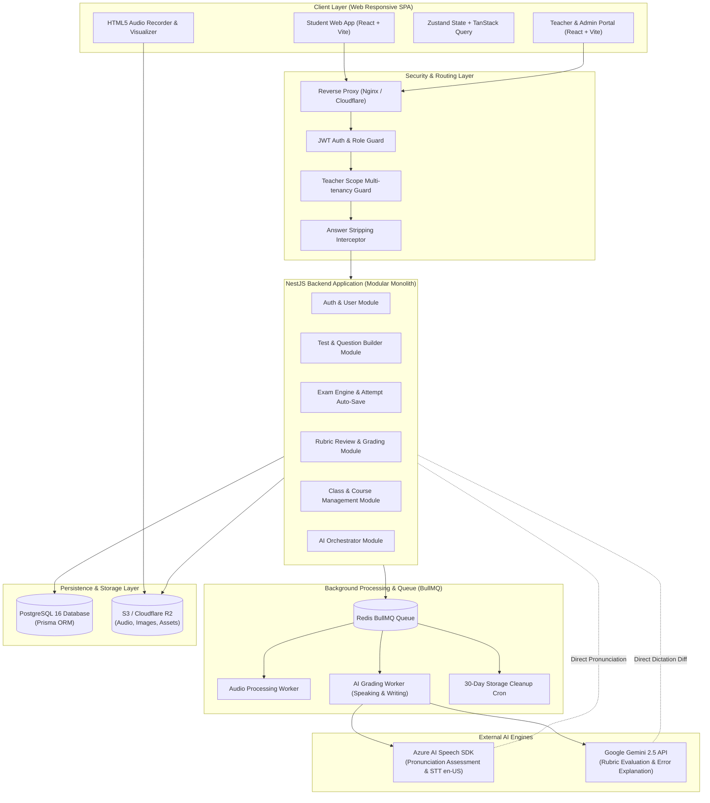
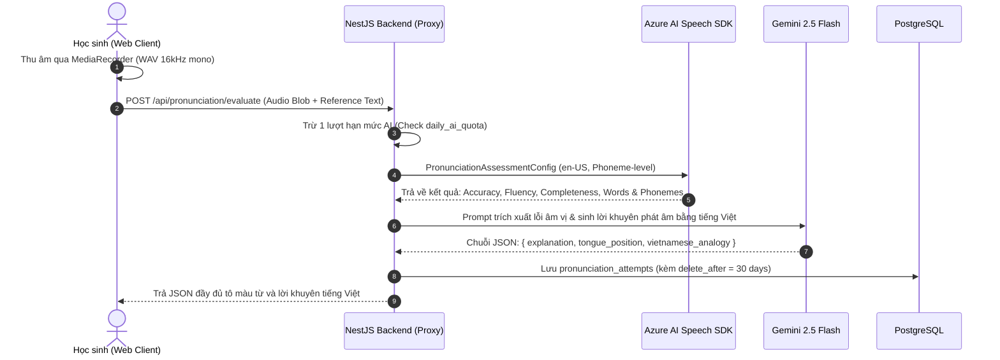
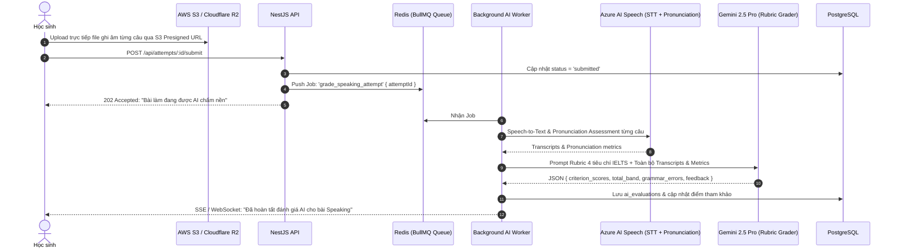

# TECH_ARCHITECTURE — Kiến Trúc Kỹ Thuật Nền Tảng Luyện Thi & Chấm Điểm AI

**Tài liệu:** Technical Architecture Document (TAD)  
**Phiên bản:** 2.0 (Official Baseline)  
**Vai trò phụ trách:** Technical Architect & Project Manager  
**Tech Stack:** React (Vite) + TailwindCSS | NestJS (TypeScript) + Prisma ORM + PostgreSQL | Azure AI Speech + Google Gemini API | Redis + BullMQ | S3/R2 Storage

---

## 1. TỔNG QUAN HỆ THỐNG & NGUYÊN TẮC THIẾT KẾ

### 1.1 Nguyên Tắc Thiết Kế Cốt Lõi (Architecture Principles)
1. **Separation of Concerns (SoC) & Clean Architecture:** Tách biệt hoàn toàn giữa Web Client (SPA) và Backend API Gateway/Services. Tầng logic nghiệp vụ độc lập với cơ sở dữ liệu và nhà cung cấp dịch vụ bên ngoài (AI, Storage).
2. **Design-to-Code Parity:** Giao diện người dùng được đồng bộ chuẩn hóa từ **Google Stitch HTML/CSS tokens** sang các thành phần tái sử dụng **React Components + TailwindCSS**.
3. **Fail-safe AI Integration:** Tất cả các tác vụ gọi AI được bọc bởi cơ chế fallback, timeout, retry và xử lý hàng đợi nền (Asynchronous Background Queue). Sự cố từ AI provider không làm gián đoạn việc nộp bài thi của học sinh.
4. **Zero-leak Answer Security:** Kiểm soát bảo mật đáp án ở cấp độ Backend Interceptor: Dữ liệu đáp án chuẩn và lời giải thích bị loại bỏ trực tiếp khỏi API Response trước khi gửi xuống Client khi đề thi ở chế độ Ẩn.
5. **Strict Multi-tenant Teacher Scoping:** Mọi truy vấn liên quan đến học sinh, bài làm và thống kê đều phải đi qua middleware xác thực quyền sở hữu lớp học (`TeacherScopeGuard`), ngăn chặn triệt để lỗ hổng IDOR.

---

## 2. SƠ ĐỒ KIẾN TRÚC TỔNG THỂ (SYSTEM ARCHITECTURE DIAGRAM)



---

## 3. KIẾN TRÚC FRONTEND (REACT + VITE + TAILWINDCSS)

### 3.1 Cấu Trúc Thư Mục Frontend (Clean Feature-based Structure)
Mã nguồn frontend được tổ chức theo module chức năng (Feature-based), giúp các kỹ sư dễ dàng chuyển đổi mã từ Google Stitch sang component:

```
frontend/
├── src/
│   ├── assets/              # Icons, illustrations, sound effects
│   ├── components/          # Reusable UI Design System (Stitch converted)
│   │   ├── ui/              # Button, Input, Modal, Dropdown, Badge, Tabs
│   │   ├── audio/           # AudioPlayer, AudioRecorder, WaveformVisualizer
│   │   ├── exam/            # QuestionPalette, CountdownTimer, SplitViewLayout
│   │   └── rubric/          # RubricScoreCard, InlineAnnotationViewer
│   ├── features/            # Feature modules
│   │   ├── auth/            # Login, Register, ForgotPassword forms
│   │   ├── exam-room/       # Exam taking view, auto-save hook, submit modal
│   │   ├── test-catalog/    # Test filter, TestCard, TestDetail
│   │   ├── dictation/       # Dictation player, diff viewer, AI explanation
│   │   ├── pronunciation/   # Speech assessment room, phoneme breakdown
│   │   ├── speaking-sim/    # 3-Part simulator, cue card, prep timer
│   │   ├── student-results/ # Score summary, answer review
│   │   ├── teacher-builder/ # 4-level test editor, question form, excel import
│   │   ├── teacher-grading/ # Rubric grading room, AI co-grader panel
│   │   └── class-mgmt/      # Class roster, invite code generator, retake grant
│   ├── hooks/               # useCountdown, useAutoSave, useAudioRecorder
│   ├── layouts/             # StudentLayout, AdminLayout, ExamRoomLayout (Zen)
│   ├── services/            # Axios API clients with auto token refresh
│   ├── stores/              # Zustand stores (authStore, examStore, audioStore)
│   └── routes/              # React Router v6 configuration with Route Guards
├── tailwind.config.js       # Tokens extracted directly from Google Stitch
└── package.json
```

### 3.2 Chiến Lược Quản Lý State & Network
- **Zustand (`examStore`):** Lưu trữ phiên làm bài trực tiếp tại máy học sinh:
  - Danh sách câu trả lời hiện tại (`answers: Record<string, any>`).
  - Thời gian còn lại (`remainingSeconds`).
  - Trạng thái gắn cờ (`flaggedQuestions: Set<string>`).
  - Lưu bản sao dự phòng xuống `localStorage` theo từng tick để đối phó sự cố tắt trình duyệt.
- **TanStack Query (React Query):** Quản lý server state, tự động cache danh mục đề thi, kết quả, và vô hiệu hoá cache (invalidation) khi có hành động mới.

---

## 4. KIẾN TRÚC BACKEND (NESTJS + PRISMA + POSTGRESQL)

### 4.1 Cấu Trúc Mô-đun Backend (NestJS Architecture)
Backend tuân thủ kiến trúc mô-đun hoá tiêu chuẩn của NestJS với Dependency Injection:

```
backend/
├── src/
│   ├── common/              # Decorators, Filters, Interceptors, Pipes
│   │   ├── decorators/      # @CurrentUser(), @Roles(), @TeacherScope()
│   │   ├── guards/          # JwtAuthGuard, RolesGuard, TeacherScopeGuard
│   │   ├── interceptors/    # AnswerSanitizerInterceptor, TransformInterceptor
│   │   └── filters/         # GlobalHttpExceptionFilter
│   ├── config/              # Environment config (Postgres, S3, Azure, Gemini)
│   ├── database/            # PrismaService, PrismaModule
│   ├── modules/
│   │   ├── auth/            # AuthController, AuthService, JwtStrategy
│   │   ├── users/           # UserController, UserService
│   │   ├── tests/           # TestController, TestService, QuestionService
│   │   ├── attempts/        # AttemptController, ExamEngineService, AutoSaveService
│   │   ├── reviews/         # ReviewController, RubricService
│   │   ├── dictation/       # DictationController, DictationDiffEngine
│   │   ├── pronunciation/   # PronunciationController, AzureSpeechProxy
│   │   ├── speaking/        # SpeakingController, SpeakingSimulationService
│   │   ├── classes/         # ClassController, CourseController
│   │   └── ai/              # AIService, GeminiProvider, AzureSpeechProvider
│   ├── queues/              # BullMQ Producers & Consumers
│   │   ├── ai-grading.processor.ts
│   │   └── cleanup.processor.ts
│   ├── app.module.ts
│   └── main.ts
├── prisma/
│   ├── schema.prisma        # Database schema definitions
│   └── migrations/          # Version-controlled DB migrations
└── package.json
```

### 4.2 Lớp Bảo Vệ & Interceptor Trọng Yếu

#### 1. `AnswerSanitizerInterceptor` (Chống rò rỉ đáp án)
Khi học sinh gọi API `GET /api/attempts/:id` hoặc `GET /api/tests/:id`:
- Kiểm tra quyền: Nếu là Học sinh (hoặc khách) và đề thi đang có `answer_visibility = 'hidden'`:
  - Đệ quy duyệt qua các câu hỏi và câu trả lời: Loại bỏ hoàn toàn 2 trường `correct_answers` và `explanation`.
  - Nếu `answer_hide_level = 'score_only'`: Loại bỏ thêm trường `is_correct` của từng câu hỏi (chỉ giữ lại `total_score`).

#### 2. `TeacherScopeGuard` (Phân lập dữ liệu đa người dùng)
Mọi endpoint quản lý học sinh và chấm bài (`/api/admin/classes/:id`, `/api/admin/reviews/:id`, `/api/admin/attempts/:id`):
- Hệ thống trích xuất `teacher_id` từ JWT.
- Nếu không phải `is_owner`: Thực hiện kiểm tra quyền sở hữu trong DB (`WHERE teacher_id = :current_user_id`). Nếu vi phạm, trả về lỗi `403 Forbidden` ngay tại tầng Guard.

---

## 5. THIẾT KẾ CƠ SỞ DỮ LIỆU (DATABASE SCHEMA - PRISMA DDL)

Dưới đây là đặc tả lược đồ dữ liệu chi tiết triển khai với Prisma ORM:

```prisma
datasource db {
  provider = "postgresql"
  url      = env("DATABASE_URL")
}

generator client {
  provider = "prisma-client-js"
}

enum Role {
  student
  admin
}

enum UserStatus {
  active
  locked
}

enum TestSkill {
  full
  listening
  reading
  writing
  speaking
}

enum TestStatus {
  draft
  published
  hidden
}

enum AnswerVisibility {
  show_after_submit
  hidden
  scheduled
}

enum AnswerHideLevel {
  keep_correctness
  score_only
}

enum QuestionType {
  single_choice
  multiple_choice
  fill_blank
  matching
  true_false_ng
  writing
  speaking
}

enum AttemptStatus {
  in_progress
  submitted
  graded
}

enum ReviewStatus {
  draft
  final
}

model User {
  id              String         @id @default(uuid()) @db.Uuid
  email           String         @unique @db.VarChar(255)
  passwordHash    String?        @map("password_hash") @db.VarChar(255)
  fullName        String         @map("full_name") @db.VarChar(100)
  avatarUrl       String?        @map("avatar_url")
  role            Role           @default(student)
  status          UserStatus     @default(active)
  isOwner         Boolean        @default(false) @map("is_owner")
  dailyAiQuota    Int            @default(20) @map("daily_ai_quota")
  createdTests    Test[]         @relation("CreatedByTeacher")
  attempts        Attempt[]
  classesOwned    Class[]        @relation("TeacherClasses")
  coursesOwned    Course[]       @relation("TeacherCourses")
  classEnrollments ClassMember[]
  courseEnrollments CourseMember[]
  reviewsDone     Review[]       @relation("TeacherReviews")
  createdAt       DateTime       @default(now()) @map("created_at") @db.Timestamptz
  updatedAt       DateTime       @updatedAt @map("updated_at") @db.Timestamptz

  @@map("users")
}

model ExamType {
  id                  String   @id @db.VarChar(50) // 'ielts', 'toeic', 'custom'
  name                String   @db.VarChar(100)
  allowedQuestionTypes Json    @map("allowed_question_types")
  defaultStructure    Json     @map("default_structure")
  scoringRules        Json     @map("scoring_rules") // Conversion tables
  defaultWritingRubricId String? @map("default_writing_rubric_id") @db.Uuid
  defaultSpeakingRubricId String? @map("default_speaking_rubric_id") @db.Uuid
  isSystem            Boolean  @default(true) @map("is_system")
  tests               Test[]

  @@map("exam_types")
}

model Test {
  id                     String           @id @default(uuid()) @db.Uuid
  title                  String           @db.VarChar(255)
  description            String?
  examTypeId             String           @map("exam_type_id") @db.VarChar(50)
  examType               ExamType         @relation(fields: [examTypeId], references: [id])
  scoringConfig          Json?            @map("scoring_config")
  writingRubricId        String?          @map("writing_rubric_id") @db.Uuid
  speakingRubricId       String?          @map("speaking_rubric_id") @db.Uuid
  maxAttempts            Int?             @map("max_attempts")
  visibility             String           @default("public") @db.VarChar(20)
  allowStudentAiGrading  Boolean          @default(true) @map("allow_student_ai_grading")
  maxAiGradingsPerAnswer Int              @default(2) @map("max_ai_gradings_per_answer")
  skill                  TestSkill        @default(full)
  difficulty             String           @default("medium") @db.VarChar(20)
  durationMinutes        Int              @map("duration_minutes")
  coverUrl               String?          @map("cover_url")
  status                 TestStatus       @default(draft)
  answerVisibility       AnswerVisibility @default(hidden) @map("answer_visibility")
  answerHideLevel        AnswerHideLevel  @default(keep_correctness) @map("answer_hide_level")
  answerReleaseAt        DateTime?        @map("answer_release_at") @db.Timestamptz
  createdBy              String           @map("created_by") @db.Uuid
  creator                User             @relation("CreatedByTeacher", fields: [createdBy], references: [id])
  sections               Section[]
  attempts               Attempt[]
  courseItems            CourseItem[]
  createdAt              DateTime         @default(now()) @map("created_at") @db.Timestamptz
  updatedAt              DateTime         @updatedAt @map("updated_at") @db.Timestamptz

  @@map("tests")
}

model Section {
  id              String          @id @default(uuid()) @db.Uuid
  testId          String          @map("test_id") @db.Uuid
  test            Test            @relation(fields: [testId], references: [id], onDelete: Cascade)
  title           String          @db.VarChar(255)
  instruction     String?
  orderIndex      Int             @map("order_index")
  durationMinutes Int?            @map("duration_minutes")
  passageText     String?         @map("passage_text")
  audioUrl        String?         @map("audio_url")
  questionGroups  QuestionGroup[]

  @@map("sections")
}

model QuestionGroup {
  id          String     @id @default(uuid()) @db.Uuid
  sectionId   String     @map("section_id") @db.Uuid
  section     Section    @relation(fields: [sectionId], references: [id], onDelete: Cascade)
  instruction String?
  passageText String?    @map("passage_text")
  audioUrl    String?    @map("audio_url")
  imageUrl    String?    @map("image_url")
  orderIndex  Int        @map("order_index")
  questions   Question[]

  @@map("question_groups")
}

model Question {
  id             String           @id @default(uuid()) @db.Uuid
  groupId        String           @map("group_id") @db.Uuid
  group          QuestionGroup    @relation(fields: [groupId], references: [id], onDelete: Cascade)
  type           QuestionType
  content        String
  options        Json?            // Array of choices
  correctAnswers Json?            @map("correct_answers") // Correct keys/texts
  points         Decimal          @default(1.0) @db.Decimal(5, 2)
  explanation    String?
  orderIndex     Int              @map("order_index")
  attemptAnswers AttemptAnswer[]
  speakingResponses SpeakingResponse[]

  @@map("questions")
}

model Attempt {
  id          String         @id @default(uuid()) @db.Uuid
  userId      String         @map("user_id") @db.Uuid
  user        User           @relation(fields: [userId], references: [id])
  testId      String         @map("test_id") @db.Uuid
  test        Test           @relation(fields: [testId], references: [id])
  attemptNo   Int            @map("attempt_no")
  mode        String         @db.VarChar(20) // 'full_test', 'practice'
  startedAt   DateTime       @map("started_at") @db.Timestamptz
  expiresAt   DateTime       @map("expires_at") @db.Timestamptz
  submittedAt DateTime?      @map("submitted_at") @db.Timestamptz
  status      AttemptStatus  @default(in_progress)
  totalScore  Decimal?       @map("total_score") @db.Decimal(6, 2)
  answers     AttemptAnswer[]
  createdAt   DateTime       @default(now()) @map("created_at") @db.Timestamptz

  @@map("attempts")
}

model AttemptAnswer {
  id              String            @id @default(uuid()) @db.Uuid
  attemptId       String            @map("attempt_id") @db.Uuid
  attempt         Attempt           @relation(fields: [attemptId], references: [id], onDelete: Cascade)
  questionId      String            @map("question_id") @db.Uuid
  question        Question          @relation(fields: [questionId], references: [id])
  answer          Json?             // Student answer
  isCorrect       Boolean?          @map("is_correct")
  score           Decimal?          @db.Decimal(5, 2)
  flagged         Boolean           @default(false)
  aiGradingsUsed  Int               @default(0) @map("ai_gradings_used")
  speakingResponse SpeakingResponse?
  aiEvaluation    AiEvaluation?
  review          Review?

  @@map("attempt_answers")
}

model SpeakingResponse {
  id              String        @id @default(uuid()) @db.Uuid
  attemptAnswerId String        @unique @map("attempt_answer_id") @db.Uuid
  attemptAnswer   AttemptAnswer @relation(fields: [attemptAnswerId], references: [id], onDelete: Cascade)
  questionId      String        @map("question_id") @db.Uuid
  question        Question      @relation(fields: [questionId], references: [id])
  audioUrl        String        @map("audio_url")
  transcript      String?
  durationSec     Decimal       @map("duration_sec") @db.Decimal(6, 2)
  prepUsedSec     Decimal?      @map("prep_used_sec") @db.Decimal(6, 2)
  deleteAfter     DateTime      @map("delete_after") @db.Timestamptz
  createdAt       DateTime      @default(now()) @map("created_at") @db.Timestamptz

  @@map("speaking_responses")
}

model AiEvaluation {
  id              String        @id @default(uuid()) @db.Uuid
  attemptAnswerId String        @unique @map("attempt_answer_id") @db.Uuid
  attemptAnswer   AttemptAnswer @relation(fields: [attemptAnswerId], references: [id], onDelete: Cascade)
  skill           String        @db.VarChar(20) // 'writing', 'speaking'
  requestedBy     String        @map("requested_by") @db.VarChar(20) // 'student', 'teacher'
  rubricId        String?       @map("rubric_id") @db.Uuid
  criterionScores Json          @map("criterion_scores")
  totalScore      Decimal       @map("total_score") @db.Decimal(5, 2)
  feedback        String
  annotations     Json?         // Inline errors, types, corrections
  metrics         Json?         // Speaking fluency, speech rate, pause count
  reportedWrong   Boolean       @default(false) @map("reported_wrong")
  reportNotes     String?       @map("report_notes")
  status          String        @default("completed") @db.VarChar(20)
  createdAt       DateTime      @default(now()) @map("created_at") @db.Timestamptz
  reviewsUsedAsDraft Review[]

  @@map("ai_evaluations")
}

model Review {
  id              String        @id @default(uuid()) @db.Uuid
  attemptAnswerId String        @unique @map("attempt_answer_id") @db.Uuid
  attemptAnswer   AttemptAnswer @relation(fields: [attemptAnswerId], references: [id], onDelete: Cascade)
  skill           String        @db.VarChar(20)
  reviewerId      String        @map("reviewer_id") @db.Uuid
  reviewer        User          @relation("TeacherReviews", fields: [reviewerId], references: [id])
  totalScore      Decimal       @map("total_score") @db.Decimal(5, 2)
  feedback        String?
  status          ReviewStatus  @default(draft)
  aiEvaluationId  String?       @map("ai_evaluation_id") @db.Uuid
  aiEvaluation    AiEvaluation? @relation(fields: [aiEvaluationId], references: [id])
  showAiErrors    Boolean       @default(true) @map("show_ai_errors")
  reviewedAt      DateTime      @default(now()) @map("reviewed_at") @db.Timestamptz
  scores          ReviewScore[]

  @@map("reviews")
}

model ReviewScore {
  id          String   @id @default(uuid()) @db.Uuid
  reviewId    String   @map("review_id") @db.Uuid
  review      Review   @relation(fields: [reviewId], references: [id], onDelete: Cascade)
  criterionId String   @map("criterion_id") @db.Uuid
  score       Decimal  @db.Decimal(5, 2)
  comment     String?

  @@map("review_scores")
}

model Class {
  id          String        @id @default(uuid()) @db.Uuid
  teacherId   String        @map("teacher_id") @db.Uuid
  teacher     User          @relation("TeacherClasses", fields: [teacherId], references: [id])
  name        String        @db.VarChar(150)
  description String?
  joinCode    String        @unique @map("join_code") @db.VarChar(10)
  status      String        @default("active") @db.VarChar(20)
  members     ClassMember[]
  courses     ClassCourse[]
  createdAt   DateTime      @default(now()) @map("created_at") @db.Timestamptz

  @@map("classes")
}

model Course {
  id          String        @id @default(uuid()) @db.Uuid
  teacherId   String        @map("teacher_id") @db.Uuid
  teacher     User          @relation("TeacherCourses", fields: [teacherId], references: [id])
  name        String        @db.VarChar(150)
  description String?
  coverUrl    String?       @map("cover_url")
  joinCode    String        @unique @map("join_code") @db.VarChar(10)
  status      String        @default("active") @db.VarChar(20)
  members     CourseMember[]
  classes     ClassCourse[]
  items       CourseItem[]
  createdAt   DateTime      @default(now()) @map("created_at") @db.Timestamptz

  @@map("courses")
}

model ClassMember {
  classId   String   @map("class_id") @db.Uuid
  class     Class    @relation(fields: [classId], references: [id], onDelete: Cascade)
  userId    String   @map("user_id") @db.Uuid
  user      User     @relation(fields: [userId], references: [id], onDelete: Cascade)
  joinedAt  DateTime @default(now()) @map("joined_at") @db.Timestamptz

  @@id([classId, userId])
  @@map("class_members")
}

model CourseMember {
  courseId  String   @map("course_id") @db.Uuid
  course    Course   @relation(fields: [courseId], references: [id], onDelete: Cascade)
  userId    String   @map("user_id") @db.Uuid
  user      User     @relation(fields: [userId], references: [id], onDelete: Cascade)
  joinedAt  DateTime @default(now()) @map("joined_at") @db.Timestamptz

  @@id([courseId, userId])
  @@map("course_members")
}

model ClassCourse {
  classId   String   @map("class_id") @db.Uuid
  class     Class    @relation(fields: [classId], references: [id], onDelete: Cascade)
  courseId  String   @map("course_id") @db.Uuid
  course    Course   @relation(fields: [courseId], references: [id], onDelete: Cascade)

  @@id([classId, courseId])
  @@map("class_courses")
}

model CourseItem {
  id         String   @id @default(uuid()) @db.Uuid
  courseId   String   @map("course_id") @db.Uuid
  course     Course   @relation(fields: [courseId], references: [id], onDelete: Cascade)
  itemType   String   @map("item_type") @db.VarChar(30) // 'test', 'listening', 'pronunciation'
  testId     String?  @map("test_id") @db.Uuid
  test       Test?    @relation(fields: [testId], references: [id], onDelete: SetNull)
  orderIndex Int      @map("order_index")

  @@map("course_items")
}
```

---

## 6. QUY TRÌNH TÍCH HỢP AI & AUDIO PIPELINE CHI TIẾT

### 6.1 Pipeline Chấm Phát Âm (Pronunciation Assessment)
Quy trình thực thi đồng bộ tốc độ cao (Sync - mục tiêu phản hồi < 7 giây):



### 6.2 Pipeline Chấm Speaking 3-Part (Asynchronous BullMQ)
Vì bài thi Speaking gồm nhiều câu và cần thời gian xử lý âm thanh kèm đánh giá Rubric sâu, quy trình chạy nền bất đồng bộ:



### 6.3 Prompt Engineering Chuẩn Hóa Chấm Writing (Gemini 2.5 Flash)
Dưới đây là cấu trúc System Prompt kiểm soát đầu ra JSON của Gemini:

```typescript
const WRITING_EVALUATION_SYSTEM_PROMPT = `
Bạn là một Giám khảo chấm thi IELTS Writing quốc tế giàu kinh nghiệm. 
Nhiệm vụ của bạn là đánh giá bài viết của học viên dựa trên Đề bài và Bộ tiêu chí Rubric chính thức.

Yêu cầu định dạng đầu ra BẮT BUỘC là một JSON Object tuân thủ đúng cấu trúc sau, không thêm markdown wrap ngoài json:
{
  "total_score": number, // Thang điểm 0 - 9 (làm tròn 0.5)
  "criterion_scores": [
    {
      "criterion_name": "Task Achievement",
      "score": number,
      "feedback": string // Nhận xét súc tích bằng tiếng Việt
    },
    {
      "criterion_name": "Coherence and Cohesion",
      "score": number,
      "feedback": string
    },
    {
      "criterion_name": "Lexical Resource",
      "score": number,
      "feedback": string
    },
    {
      "criterion_name": "Grammatical Range and Accuracy",
      "score": number,
      "feedback": string
    }
  ],
  "annotations": [
    {
      "start_index": number,
      "end_index": number,
      "error_text": string,
      "error_type": "grammar" | "vocabulary" | "punctuation" | "cohesion",
      "suggestion": string,
      "explanation_vi": string // Giải thích ngắn bằng tiếng Việt
    }
  ],
  "general_feedback": string // Lời khuyên tổng quan giúp cải thiện bài viết
}
`;
```

---

## 7. QUY ĐỊNH LƯU TRỮ & CHU TRÌNH DỌN DẸP 30 NGÀY (RETENTION CLEANUP)

### 7.1 Cấu Trúc Bucket S3
- `s3://edtech-assets/public/tests/`: Ảnh bìa đề thi, audio đề Listening công khai.
- `s3://edtech-assets/audios/pronunciation/{userId}/{attemptId}.wav`
- `s3://edtech-assets/audios/speaking/{userId}/{responseId}.wav`

### 7.2 Job Dọn Dẹp Định Kỳ (Daily Cron Worker)
Sử dụng `@nestjs/schedule` và BullMQ chạy vào lúc 02:00 sáng hàng ngày:

```typescript
@Injectable()
export class RetentionCleanupService {
  @Cron('0 2 * * *') // Chạy mỗi đêm lúc 2:00 AM
  async handleStorageCleanup() {
    const expiredRecordings = await this.prisma.speakingResponse.findMany({
      where: {
        deleteAfter: { lte: new Date() },
        audioUrl: { not: '' }
      },
      take: 1000,
    });

    for (const record of expiredRecordings) {
      await this.s3Service.deleteObject(record.audioUrl);
      await this.prisma.speakingResponse.update({
        where: { id: record.id },
        data: { audioUrl: '[EXPIRED_AND_DELETED]' }
      });
    }
  }
}
```

---

## 8. DANH MỤC API GATEWAY SPECIFICATIONS (RESTful CONTRACT)

### 8.1 Nhóm Authentication & Profile
- `POST /api/auth/register`: Đăng ký tài khoản học sinh.
- `POST /api/auth/login`: Đăng nhập, cấp JWT Access (15m) & Refresh Token (7d).
- `POST /api/auth/refresh`: Cấp mới Access Token.
- `GET /api/users/me`: Lấy thông tin user hiện tại và hạn mức AI còn lại.

### 8.2 Nhóm Đề Thi & Phòng Thi (Exam & Attempt)
- `GET /api/tests`: Lấy danh sách đề thi (hỗ trợ query filter kiểu đề, kỹ năng, tìm kiếm).
- `GET /api/tests/:id`: Chi tiết đề thi. Nếu là học sinh, che giấu đáp án đúng.
- `POST /api/attempts/start`: Bắt đầu lượt thi, trừ lượt làm, khởi tạo timer server.
- `POST /api/attempts/:id/auto-save`: Tự động lưu đáp án tạm thời theo chu kỳ.
- `POST /api/attempts/:id/submit`: Nộp bài thi, chấm trắc nghiệm tức thì.
- `GET /api/attempts/:id/result`: Xem kết quả bài thi (áp dụng `AnswerSanitizerInterceptor`).

### 8.3 Nhóm Chấm Điểm & AI Evaluation
- `POST /api/evaluations/writing`: Học sinh yêu cầu AI chấm tham khảo bài Writing.
- `POST /api/pronunciation/evaluate`: Gửi audio phát âm chấm điểm qua Azure Speech SDK.
- `POST /api/dictation/evaluate`: So khớp diff từ vựng và gọi Gemini giải thích lỗi.
- `POST /api/admin/reviews`: Giáo viên lưu nháp / hoàn tất chấm bài theo Rubric.

### 8.4 Nhóm Quản Trị & Lớp Học (Admin & Classes)
- `POST /api/admin/tests`: Giáo viên khởi tạo đề thi mới.
- `PUT /api/admin/tests/:id/sections`: Cập nhật cấu trúc section và question groups.
- `POST /api/admin/tests/import-excel`: Import câu hỏi hàng loạt từ file Excel.
- `PUT /api/admin/tests/:id/answer-visibility`: Thay đổi chế độ hiển thị đáp án.
- `POST /api/admin/students/:userId/grant-retake`: Cấp thêm lượt thi cho học sinh.
- `POST /api/classes`: Tạo lớp học và sinh mã mời.
- `POST /api/classes/join`: Học sinh nhập mã mời tham gia lớp.
