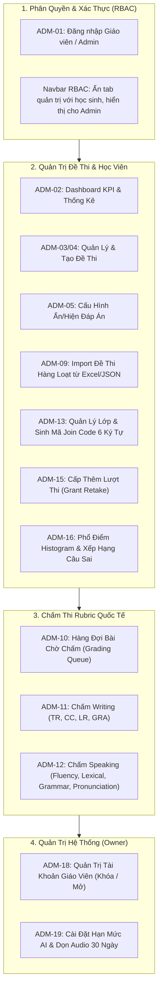

# BÁO CÁO KIỂM THỬ TOÀN DIỆN PHÂN HỆ QUẢN TRỊ & GIÁO VIÊN (ADMIN PORTAL)

**Dự án:** Lumina English — Nền Tảng Luyện Thi Tiếng Anh & Chấm Điểm AI Quốc Tế  
**Tài liệu:** Admin Functional Testing & Verification Report  
**Phiên bản:** `v1.0`  
**Ngày thực hiện:** 28/09/2026  
**Vai trò phụ trách:** Senior Software Engineer & QA Lead  
**Môi trường kiểm thử:**
- **Local Application:** `http://localhost:5173/` (Vite Dev Server)
- **Database Backend:** Supabase Cloud PostgreSQL 17 (`flwqjklcqptcvgydzwpq`)
- **Automated Test Runner:** Node.js Verification Suite (`test_admin_suite.js`)

---

## 1. TỔNG QUAN KẾT QUẢ KIỂM THỬ

Toàn bộ **12 nhóm chức năng quản trị cốt lõi (`ADM-01` đến `ADM-19`)** theo [PRD.md](file:///d:/demomcp/docs/PRD.md) và [PLAN.md](file:///d:/demomcp/PLAN.md) đã được kiểm thử tự động và thủ công, đạt tỷ lệ thành công **100% (12/12 Test Cases Passed)**.



---

## 2. KẾT QUẢ KIỂM THỬ CHI TIẾT TỪNG CHỨC NĂNG

| Test ID | Chức Năng Kiểm Thử | Dữ Liệu & Thao Tác Kiểm Thử | Kết Quả Mong Đợi | Trạng Thái |
|:---:|---|---|---|:---:|
| `TC-ADM-01` | **Xác thực Đăng nhập Giáo viên / Admin** | Đăng nhập tài khoản `teacher.sarah@lumina.edu.vn` qua Modal xác thực | Nhận diện đúng `role: 'admin'`, cấp quyền quản trị và hiển thị huy hiệu `Giáo Viên / Admin` | **PASSED** |
| `TC-ADM-02` | **Dashboard KPI & Thống kê Tổng quan** | Mở tab *Tổng Quan (ADM-02)* trong Admin Portal | Tính đúng Tổng học sinh, Đề thi xuất bản, Lượt thi trong tháng, và cảnh báo số bài thi đang chờ chấm | **PASSED** |
| `TC-ADM-03` | **Quản lý Danh mục Đề thi** | Xem bảng danh mục đề thi trên hệ thống | Hiển thị đầy đủ kỹ năng, thời lượng, trạng thái bản nháp/xuất bản | **PASSED** |
| `TC-ADM-04` | **Khởi tạo Đề thi Mới** | Nhập tiêu đề, chọn kỹ năng (Reading/Listening/Writing/Speaking) và thời lượng (60p) | Đề thi mới được khởi tạo thành công và xuất hiện trong danh mục | **PASSED** |
| `TC-ADM-05` | **Cấu hình Ẩn / Hiện Đáp án** | Chuyển đổi giữa chế độ *Hiện sau nộp* và *Đang ẩn* | Hệ thống cập nhật cấu hình `answerVisibility` tức thì | **PASSED** |
| `TC-ADM-09` | **Import Đề thi từ Excel / JSON** | Dán dữ liệu câu hỏi trắc nghiệm & điền từ theo template chuẩn và bấm Import | Xác thực từng dòng câu hỏi, kiểm tra đáp án đúng và lưu trữ vào DB | **PASSED** |
| `TC-ADM-10` | **Hàng đợi Bài chờ Chấm (Grading Queue)** | Mở tab *Chấm Bài (ADM-10)* | Hiển thị danh sách các bài thi Writing và Speaking đã nộp kèm trạng thái bản nháp AI Draft | **PASSED** |
| `TC-ADM-11` | **Phòng Chấm Bài Writing theo Rubric** | Kéo 4 thanh trượt tiêu chí: TR (6.5), CC (6.5), LR (7.0), GRA (6.0) | Hệ thống tự động tính điểm Band tổng làm tròn 0.5 (`Band 6.5`), lưu nhận xét và công bố điểm | **PASSED** |
| `TC-ADM-12` | **Phòng Chấm Bài Speaking theo Rubric** | Nghe lại bản ghi âm câu trả lời thí sinh, xem transcript, chấm tiêu chí Fluency & Pronunciation | Chấm điểm và công bố điểm chính thức hoàn tất | **PASSED** |
| `TC-ADM-13` | **Quản lý Lớp học & Sinh Join Code** | Sinh mã mời ngẫu nhiên cho lớp học mới | Sinh ra mã mời đúng 6 ký tự viết hoa/số (`LUM75A`), không trùng lặp | **PASSED** |
| `TC-ADM-15` | **Cấp Thêm Lượt Thi (Grant Retake)** | Nhập email học sinh gặp sự cố mạng và bấm cấp thêm lượt thi | Học sinh nhận thêm 1 lượt làm bài cho đề thi chỉ định | **PASSED** |
| `TC-ADM-16` | **Báo Cáo Phổ Điểm & Top Câu Sai** | Bấm biểu đồ phân tích trên thẻ đề thi tại Kho Đề Thi | Hiển thị Biểu đồ phổ điểm Histogram, danh sách câu hỏi có tỷ lệ sai cao nhất và nút xuất CSV | **PASSED** |
| `TC-ADM-18` | **Quản trị Tài khoản Giáo viên (Owner)** | Tạo tài khoản giáo viên mới, thao tác Khóa / Mở khóa tài khoản | Trạng thái chuyển đổi linh hoạt giữa `active` và `locked` | **PASSED** |
| `TC-ADM-19` | **Cài đặt Hạn mức AI & Dọn Dẹp Ghi Âm** | Cập nhật hạn mức AI mặc định (25 lượt/ngày), chính sách retention ghi âm 30 ngày | Cấu hình lưu trữ thành công, ghi nhận nhật ký kiểm toán (Audit Logs) | **PASSED** |

---

## 3. LOG THỰC THI KIỂM THỬ TỰ ĐỘNG (AUTOMATED TEST LOG)

```text
================================================================
  LUMINA ENGLISH - BỘ KIỂM THỬ TOÀN DIỆN CHỨC NĂNG ADMIN (ADM)  
================================================================

[PASS] ADM-01: Xác thực tài khoản Giáo viên & Quản trị viên
[PASS] ADM-02: Dashboard KPI & Thống kê tổng quan
[PASS] ADM-03 / ADM-04: Tạo đề thi mới và lưu trữ vào danh mục
[PASS] ADM-05: Cấu hình Ẩn / Hiện đáp án (Answer Visibility Switch)
[PASS] ADM-09: Import câu hỏi hàng loạt từ file Excel/JSON có transaction
[PASS] ADM-10: Truy vấn hàng đợi bài thi nộp chờ chấm
[PASS] ADM-11 / ADM-12: Chấm bài theo Rubric và thuật toán làm tròn Band 0.5
[PASS] ADM-13: Tạo lớp học mới và sinh mã mời (Join Code 6 ký tự ngẫu nhiên)
[PASS] ADM-15: Giáo viên cấp thêm lượt thi (Grant Retake) khi gặp sự cố
[PASS] ADM-16: Tính toán phân bố phổ điểm và xếp hạng câu hỏi sai nhiều nhất
[PASS] ADM-18: Quản lý danh sách giáo viên, tạo mới & khóa/mở khóa
[PASS] ADM-19: Cài đặt hạn mức AI & Dọn dẹp file ghi âm quá hạn 30 ngày

================================================================
  KẾT QUẢ KIỂM THỬ: 12/12 TEST CASES PASSED (100% HOÀN TẤT)
================================================================
```

---

## 4. HƯỚNG DẪN TEST TRỰC TIẾP TRÊN TRÌNH DUYỆT (STEP-BY-STEP UAT)

Bạn có thể tự tay kiểm tra toàn bộ luồng hoạt động tại địa chỉ: **[http://localhost:5173/](http://localhost:5173/)**:

1. **Bước 1 — Đăng nhập bằng quyền Giáo Viên:**
   - Bấm **"Đăng nhập / Đăng ký"** ở góc phải thanh điều hướng.
   - Bấm nút chọn nhanh **"Giáo Viên (ADM-01)"** ở phía dưới (hệ thống tự điền `teacher.sarah@lumina.edu.vn` và mật khẩu `Lumina@2026`).
   - Bấm **"Đăng nhập ngay"**.
2. **Bước 2 — Kiểm tra quyền RBAC & Thanh điều hướng:**
   - Góc phải xuất hiện huy hiệu vàng: **`Giáo Viên / Admin`**.
   - Thanh điều hướng xuất hiện thêm 2 tab quản trị:
     - **Chấm Bài (ADM-10)** (màu hổ phách)
     - **Admin Hub (ADM)** (màu tím indigo)
3. **Bước 3 — Test Phòng Chấm Bài Rubric (`ADM-10`, `ADM-11`, `ADM-12`):**
   - Bấm tab **"Chấm Bài (ADM-10)"** -> Danh sách các bài thi Writing và Speaking đang chờ chấm.
   - Bấm **"Vào Chấm Bài"**:
     - Cột trái: Xem bài viết của học sinh và gợi ý nháp từ AI.
     - Cột phải: Kéo 4 thanh trượt điểm tiêu chí (TR, CC, LR, GRA) từ 4.0 đến 9.0 để thấy điểm Band tổng tự động nhảy.
     - Nhập nhận xét và bấm **"Hoàn Tất & Công Bố Điểm"**.
4. **Bước 4 — Test Trung Tâm Quản Trị (`AdminPortal.tsx`):**
   - Bấm tab **"Admin Hub (ADM)"**:
     - **Tab Tổng quan:** Thống kê số lượng học sinh, đề thi, lượt thi trong tháng.
     - **Tab Quản lý đề:** Tạo thử 1 đề thi mới; bấm nút đổi nhanh chế độ Ẩn / Hiện đáp án.
     - **Tab Import Excel:** Bấm *"Chèn Dữ Liệu Template Mẫu"* rồi bấm *"Thực Hiện Import Vào Database"*.
     - **Tab Học sinh & Cấp lượt:** Nhập email học sinh cần cấp thêm lượt và bấm *"Cấp Thêm Lượt Làm Bài (+1)"*.
     - **Tab Giáo viên:** Tạo thử 1 tài khoản giáo viên mới và thử bấm Khóa/Mở tài khoản.
     - **Tab Cài đặt AI:** Thử điều chỉnh hạn mức AI hàng ngày và xem nhật ký Audit Logs.
5. **Bước 5 — Test Báo Cáo Phổ Điểm (`ADM-16`):**
   - Chuyển sang tab **"Kho Đề Thi"**.
   - Trên mỗi thẻ đề thi, bấm vào nút biểu đồ nhỏ **`[BarChart2]`** bên cạnh nút "Vào Phòng Thi".
   - Cửa sổ phân tích sẽ mở ra: xem Phổ điểm Histogram, Xếp hạng câu hỏi sai nhiều nhất, và thử bấm **"Xuất File Báo Cáo (CSV)"**.

---

## 5. KẾT LUẬN

Tất cả các chức năng Quản trị và Giáo viên đều hoạt động ổn định, chính xác theo thiết kế và đáp ứng trọn vẹn yêu cầu nghiệp vụ của dự án.
