# BÁO CÁO KIỂM TRA & HOÀN THIỆN PHÂN HỆ TẠO ĐỀ THI (EXAM CREATION & BUILDER)

**Dự án:** Lumina English — Nền Tảng Luyện Thi Tiếng Anh & Chấm Điểm AI Quốc Tế  
**Tài liệu:** Báo cáo kiểm tra và nâng cấp tính năng Tạo Đề Thi & Quản Trị Ngân Hàng Câu Hỏi  
**Phiên bản:** `v1.0`  
**Ngày thực hiện:** 28/09/2026  
**Vai trò phụ trách:** Senior Software Engineer  
**Hệ thống đối chiếu:** [PRD-website-luyen-thi.md](file:///d:/demomcp/PRD-website-luyen-thi.md) (Mục `GV-03` đến `GV-08`, `GV-13`), [TECH_ARCHITECTURE.md](file:///d:/demomcp/TECH_ARCHITECTURE.md), [PLAN.md](file:///d:/demomcp/PLAN.md)

---

## 1. TỔNG QUAN YÊU CẦU & KẾT QUẢ KIỂM TRA

Theo yêu cầu của người dùng: **"kiểm tra tạo đề thi"**, toàn bộ luồng tạo, biên soạn và quản trị đề thi đã được rà soát chi tiết trên toàn bộ 3 tầng kiến trúc (Database Supabase Cloud, Backend NestJS API và Frontend React SPA).

```mermaid
flowchart TD
    subgraph UI ["Giao Diện Quản Trị (Admin / Teacher UI)"]
        QF["Form Tạo Nhanh (GV-03)<br/>Tiêu đề, Kiểu đề, Kỹ năng, Độ khó, Lượt làm, Ẩn/Hiện đáp án"]
        TBM["Trình Soạn Đề Chi Tiết (TestBuilderModal.tsx)<br/>GV-04: Phân đoạn, Bài đọc Passage, File nghe Audio<br/>GV-05: 7 Dạng câu hỏi, Lựa chọn, Đáp án đúng, Giải thích"]
        EXC["Import Đề Hàng Loạt (GV-06)<br/>Dán JSON / Excel Dropzone, Mẫu IELTS/TOEIC"]
        PREV["Thi Thử & Xem Trước (GV-08)<br/>Vào thẳng phòng thi không tính vào thống kê"]
    end

    subgraph API ["Backend Tests Module (NestJS 10 + Prisma)"]
        C_API["POST /api/tests<br/>Tạo đề phẳng hoặc tạo kèm Section & Questions đa tầng"]
        U_API["PUT /api/tests/:id<br/>Cập nhật thông số đề thi"]
        D_API["DELETE /api/tests/:id<br/>Ẩn đề nếu có lượt thi (GV-03) hoặc xóa cứng"]
        V_API["PUT /api/tests/:id/answer-visibility<br/>1-Click Ẩn/Hiện đáp án (GV-13)"]
        I_API["POST /api/tests/import-excel<br/>Chuẩn hoá linh hoạt các schema câu hỏi"]
    end

    subgraph DB ["Cơ Sở Dữ Liệu (Supabase PostgreSQL 17)"]
        T_DB[("Bảng tests<br/>b0000000-0000-0000-0000-000000000001")]
        S_DB[("Bảng sections<br/>Passage & Audio URL")]
        G_DB[("Bảng question_groups<br/>Instruction & Order")]
        Q_DB[("Bảng questions<br/>7 Kiểu câu hỏi, Options, Correct Answers, Explanation")]
    end

    UI --> API
    API --> DB
```

---

## 2. CHI TIẾT CÁC ĐIỂM ĐÃ KIỂM TRA & NÂNG CẤP

### 2.1. Cơ Sở Dữ Liệu Supabase PostgreSQL 17
- **Bảng `tests`:** Đã cấu hình và lưu trữ đầy đủ các thuộc tính cốt lõi theo `GV-03`: `id`, `title`, `description`, `exam_type_id`, `skill`, `difficulty`, `duration_minutes`, `max_attempts`, `visibility`, `allow_student_ai_grading`, `answer_visibility`, `answer_hide_level`, `status`, `created_by`.
- **Dữ liệu phân đoạn & câu hỏi:** Đã thực thi bổ sung các bản ghi thực tế cho đề thi mẫu IELTS Reading (`b0000000-0000-0000-0000-000000000001`):
  - Phân đoạn `sections`: *Passage 1: The Secret Life of Coral Reefs*
  - Nhóm câu hỏi `question_groups`: Hướng dẫn làm bài True/False/Not Given
  - Danh mục câu hỏi `questions`: 5 câu hỏi thực tế (dạng `true_false_ng`, `single_choice`, `fill_blank`) kèm đáp án đúng và lời giải thích đối chiếu từ bài đọc.

---

### 2.2. Backend API (`NestJS 10` + `Prisma`)
- **`POST /api/tests` (`create`):**
  - Đã nâng cấp để nhận cả dữ liệu đề thi đơn giản lẫn cấu trúc lồng nhau (`sections -> questionGroups -> questions`). Khi giáo viên sử dụng Trình soạn thảo chi tiết, toàn bộ bài đọc và danh sách câu hỏi được khởi tạo tự động, nguyên tử (atomic) trong một yêu cầu duy nhất.
- **`PUT /api/tests/:id` (`update`):**
  - Cập nhật linh hoạt thông số đề thi: thời gian, độ khó, số lần làm tối đa, chế độ đáp án.
- **`DELETE /api/tests/:id` (`delete`):**
  - Tuân thủ nghiêm ngặt quy định `GV-03`: Nếu đề đã có học sinh làm bài (`attempts.length > 0`), hệ thống tự động chuyển trạng thái `status: 'hidden'` để bảo toàn lịch sử và điểm số; chỉ xóa cứng với đề nháp chưa có bài nộp.
- **`POST /api/tests/import-excel` (`importExcel`):**
  - Chuẩn hoá tương thích: Nhận diện cả `title` và `testTitle`; tự động bọc danh sách câu hỏi phẳng (`questions`) thành cấu trúc 4 cấp nếu người dùng import từ file Excel không chia phân đoạn; hỗ trợ đồng thời `questionText` / `content`, `questionType` / `type`, `score` / `points`.
- **`PUT /api/tests/:id/answer-visibility` (`updateAnswerVisibility`):**
  - Chuyển đổi nhanh 3 chế độ: `hidden` (mặc định), `show_after_submit` và `scheduled`.

---

### 2.3. Giao Diện Người Dùng Frontend (`React 18` + `TailwindCSS`)
1. **Form Tạo Nhanh (`AdminPortal.tsx` - Tab Quản Lý Đề):**
   - Hỗ trợ đầy đủ các trường: Tiêu đề đề thi, Kiểu đề (`IELTS`, `TOEIC`, `Khác`), Kỹ năng (`Reading`, `Listening`, `Writing`, `Speaking`, `Full Test`), Thời gian làm bài, Độ khó, Chế độ ẩn đáp án mặc định, Giới hạn lượt làm bài, và Checkbox cho phép học sinh nhờ AI chấm tham khảo (`GV-03`).
2. **Trình Soạn Đề Chi Tiết Đa Tầng (`TestBuilderModal.tsx` - GV-03, GV-04, GV-05):**
   - Quản lý phân đoạn thi: Nhập tiêu đề Section, bài đọc Passage hoặc đường dẫn Audio URL (`GV-04`, `GV-07`).
   - Quản lý câu hỏi 7 dạng (`GV-05`): Single choice, Multiple choice, True/False/Not Given, Fill in the blank, Matching, Writing, Speaking.
   - Thiết lập các phương án lựa chọn, chỉ định đáp án đúng, điểm số và lời giải thích chi tiết.
   - Nút nạp mẫu đề thi chuẩn IELTS giúp giáo viên kiểm thử nhanh chỉ trong 1 thao tác.
3. **Bảng Danh Sách Đề Thi & Thao Tác (Actions):**
   - **Nút Thi Thử / Xem Trước (`GV-08`):** Cho phép giáo viên nhấn xem trước để vào thẳng giao diện phòng thi (`ExamRoom`) trải nghiệm như học sinh mà không ảnh hưởng tới thống kê lượt làm.
   - **Nút Chuyển Đổi Ẩn/Hiện Đáp Án (`GV-13`):** 1-Click chuyển đổi giữa `Đang Ẩn` và `Hiện Sau Nộp`.
   - **Nút Xóa / Lưu Trữ (`GV-03`):** Thực thi API xóa an toàn.
4. **Nhập Đề Hàng Loạt (Tab Import Excel - GV-06):**
   - Đã sửa cấu trúc payload đồng bộ với backend.
   - Tích hợp 2 bộ mẫu câu hỏi có sẵn: Mẫu đa dạng (T/F/NG + Trắc nghiệm + Điền từ) và Mẫu TOEIC.
5. **Giao Diện Phòng Thi (`ExamRoom.tsx`):**
   - Nâng cấp cơ chế chấm điểm động theo các câu hỏi thực tế được tạo trong DB.
   - Hỗ trợ khung gõ câu trả lời dạng văn bản đối với câu hỏi điền từ (`fill_blank`).

---

## 3. KẾT QUẢ KIỂM THỬ TỰ ĐỘNG

Kịch bản kiểm thử độc lập đã được khởi tạo và chạy thành công tại [test_exam_creation.js](file:///C:/Users/namvn/.gemini/antigravity-ide/brain/02d40f1a-a80d-4342-923b-6005fbffa91e/scratch/test_exam_creation.js):

| Mã Test | Nội Dung Kiểm Thử | Tiêu Chí PRD | Kết Quả |
|---|---|---|:---:|
| `TEST 1` | Tạo nhanh đề thi thông số đầy đủ (Title, Type, Duration, MaxAttempts, Visibility) | `GV-03`, `GV-13` | **PASS (100%)** |
| `TEST 2` | Soạn đề đa tầng (Test -> Section -> Question Group -> Question) với 4 dạng câu hỏi | `GV-04`, `GV-05` | **PASS (100%)** |
| `TEST 3` | Import đề thi hàng loạt tự động chuẩn hóa schema (JSON / Excel) | `GV-06` | **PASS (100%)** |
| `TEST 4` | Chuyển đổi 1-click chế độ Ẩn / Hiện đáp án | `GV-13` | **PASS (100%)** |
| `TEST 5` | Chính sách xóa: tự động chuyển sang `status: hidden` khi đề đã có lượt thi | `GV-03` | **PASS (100%)** |

**Kết quả build:**
- `frontend`: `tsc && vite build` -> Thành công không có lỗi (Module count: 1483).
- `backend`: `nest build` -> Thành công không có lỗi.

---

## 4. HƯỚNG DẪN TRẢI NGHIỆM TẠO ĐỀ THI TRÊN GIAO DIỆN

1. Mở ứng dụng tại địa chỉ: **`http://localhost:5173/`**.
2. Đăng nhập với tài khoản Giáo viên / Quản trị viên:
   - **Email:** `teacher.sarah@lumina.edu.vn` (hoặc `owner@lumina-english.vn`)
   - **Mật khẩu:** `Lumina@2026` (hoặc nhấn nút 1-click trên Modal Đăng Nhập).
3. Vào tab **"Quản Trị"** trên thanh điều hướng.
4. Chọn tab **"Quản Lý Đề"**:
   - **Cách 1 (Tạo Nhanh):** Điền các thông số ở form bên trái (Tiêu đề, Kỹ năng, Kiểu đề, Độ khó, Giới hạn lượt làm, Chế độ đáp án) -> Bấm **"Lưu & Xuất Bản Đề Thi"**.
   - **Cách 2 (Soạn Chi Tiết):** Bấm nút màu tím **"Mở Trình Soạn Đề Chi Tiết (Test Builder)"** -> Nhập bài đọc, thêm các dạng câu hỏi trắc nghiệm / điền từ / True-False-NG -> Bấm **"Lưu & Xuất Bản Đề Thi"**.
   - **Cách 3 (Import Excel/JSON):** Chuyển sang tab **"Import Excel"** -> Bấm **"Mẫu Đa Dạng"** -> Bấm **"Thực Hiện Import Vào Database"**.
5. Trong bảng danh sách đề thi:
   - Bấm nút **Play (▶)** để **Thi Thử / Xem Trước (GV-08)** đề thi vừa tạo ngay lập tức.
   - Bấm biểu tượng **Mắt (👁 / 👁‍🗨)** để bật/tắt chế độ **Ẩn/Hiện Đáp Án (GV-13)**.
